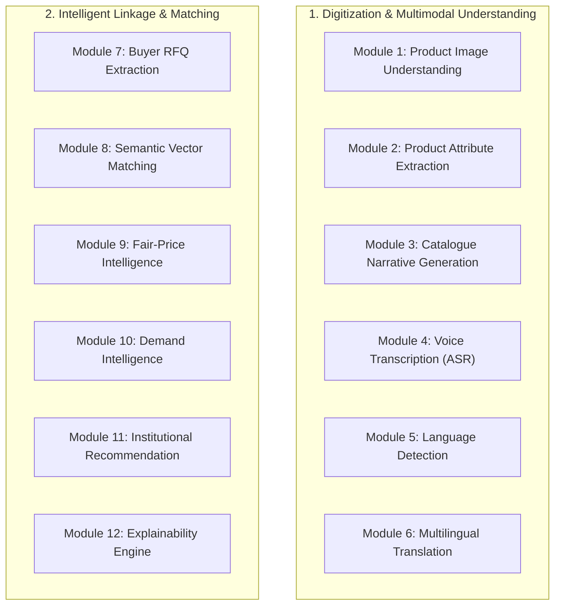
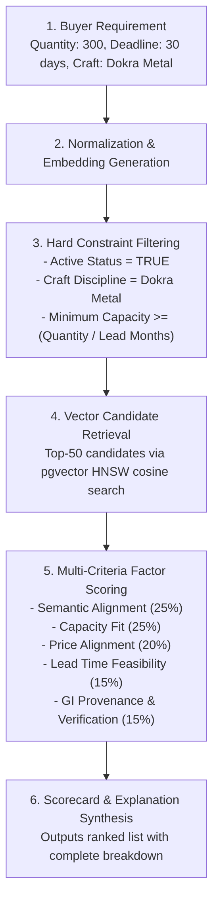

# SIH 26090: AI Architecture & Intelligence Strategy
## Specification of 12 Modular AI Subsystems, Explainable Matching & Honesty Protocols

---

## 1. AI Honesty Charter & Governance Protocol

The SIH 26090 platform adheres to the following foundational governance rules:
1. **No Silent Fact Promotion**: An AI-extracted craft attribute (such as "Chanderi Weave" or "Natural Indigo Dye") is classified strictly as an `AI_SUGGESTION` until the artisan explicitly reviews and verifies it.
2. **Explicit Confidence Metrics**: Every AI inference generates a confidence score between `0.00` and `1.00`. Suggestions with confidence below `0.70` prompt the user for manual verification.
3. **Refusal to Fabricate on Cold Starts**: If insufficient historical observations exist for demand forecasting or price intelligence, the system explicitly returns an honest status: `"Insufficient historical observations for reliable projection"`. Under no circumstances are synthetic numbers manufactured to populate UI graphs.

---

## 2. Specification of 12 Independent AI Modules



---

### Module 1: Product Image Understanding
- **Input**: Raw product photograph (JPEG/WebP/PNG, max 10MB).
- **Output**: Visual attributes JSON (primary craft family, detected technique e.g., block print vs hand embroidery, dominant color palette HEX, visual texture quality).
- **Model Category**: Multimodal Vision-Language Model (Gemini 1.5/2.0 Flash Vision / Open-source CLIP/ViT).
- **Confidence Handling**: Returns classification probability per attribute. If confidence < 0.65, attribute is marked as `UNCONFIRMED_SUGGESTION`.
- **Fallback Behavior**: Fallback to rule-based craft category heuristics based on the artisan's registered primary craft.
- **Validation Strategy**: Evaluated against a benchmark dataset of 500 labeled Indian handicraft images.
- **Training Data Required**: Zero-shot / few-shot prompting with reference handicraft taxonomy; no fine-tuning required for Phase 1.

### Module 2: Product Attribute Extraction
- **Input**: Extracted visual features + transcribed voice audio text.
- **Output**: Normalized technical specifications (material composition, estimated dimensions, weight category, GI tag compatibility).
- **Model Category**: Structured Output LLM (Pydantic function calling / JSON Schema enforcement).
- **Confidence Handling**: Field-level confidence scores. Low-confidence fields trigger interactive UI confirmation chips.
- **Fallback Behavior**: Standard craft category attribute schema pre-filled with national cluster defaults.
- **Validation Strategy**: JSON Schema strict validation; rejection of malformed outputs.
- **Training Data Required**: Prompt-based schema extraction; fine-tuning not required.

### Module 3: Catalogue Generation
- **Input**: Confirmed technical attributes, craft heritage history from database, artisan community story.
- **Output**: Multilingual product title, cultural storytelling narrative, SEO bullet points, material care guide.
- **Model Category**: Generative LLM with cultural heritage system prompt.
- **Confidence Handling**: Stylistic generation; evaluated for presence of required technical details and absence of hallucinations.
- **Fallback Behavior**: Deterministic template-based string concatenation (`{Craft Name} handcrafted with {Material} by {Artisan Name}`).
- **Validation Strategy**: Automated checking for hallucinated certifications not present in the artisan's profile.
- **Training Data Required**: Curated cultural heritage context injected via RAG from verified GI registry descriptions.

### Module 4: Voice Transcription (ASR)
- **Input**: Opus/WebM audio stream (max 60 seconds) recorded via browser Web Audio API.
- **Output**: Normalized text transcript in the spoken Indic language script.
- **Model Category**: Indic ASR (OpenAI Whisper Large-v3 / AI4Bharat IndicWhisper / Bhashini API).
- **Confidence Handling**: Word-level log probabilities. If audio SNR (signal-to-noise ratio) is too low, returns an error prompting the artisan to re-record in a quiet room.
- **Fallback Behavior**: Graceful fallback to voice-free visual stepper wizard.
- **Validation Strategy**: Word Error Rate (WER) benchmarking on regional dialect voice samples.
- **Training Data Required**: Pre-trained Indic ASR models.

### Module 5: Language Detection
- **Input**: Audio bytes or raw text string.
- **Output**: ISO 639-1 language code (e.g., `hi`, `mr`, `ta`, `te`, `bn`, `gu`, `kn`, `en`) and detection confidence.
- **Model Category**: FastText language identifier / Whisper audio language classification.
- **Confidence Handling**: If confidence < 0.80, default to user's saved profile preference.
- **Fallback Behavior**: Fallback to artisan's registered district default language.
- **Validation Strategy**: Unit tests on standard multilingual test sentences.
- **Training Data Required**: Pre-trained off-the-shelf classifier.

### Module 6: Multilingual Text Processing & Translation
- **Input**: Source text in Indic language + target language code.
- **Output**: Accurate contextual translation preserving traditional craft terminology (e.g., *Zari*, *Bandhani*, *Kalamkari* remain uncorrupted).
- **Model Category**: IndicTrans2 / Gemini Multilingual API.
- **Confidence Handling**: BLEU/chrF validation against craft terminology glossary.
- **Fallback Behavior**: Side-by-side display of original language text with transliteration.
- **Validation Strategy**: Dictionary lock on 200+ protected Indian handicraft terms.
- **Training Data Required**: Off-the-shelf model supplemented with custom handicraft domain glossary.

### Module 7: Buyer Requirement Extraction (RFQ Parsing)
- **Input**: Unstructured buyer text ("Looking for 200 hand-carved Sheesham wood boxes for corporate gifting by Oct 15, budget under ₹800") or uploaded PDF RFQ.
- **Output**: Structured `BuyerRequirement` schema (craft_category, quantity, target_price_max, delivery_deadline, material_constraints).
- **Model Category**: Zero-shot information extraction LLM with Pydantic JSON validation.
- **Confidence Handling**: Highlights extracted parameters in UI for one-click buyer confirmation.
- **Fallback Behavior**: Direct manual entry form.
- **Validation Strategy**: Evaluation against synthetic and real corporate gifting procurement briefs.
- **Training Data Required**: None.

### Module 8: Semantic Vector Matching
- **Input**: 768-dimensional buyer requirement vector + candidate product/artisan profile vectors.
- **Output**: Cosine similarity score (0.0000 to 1.0000).
- **Model Category**: Dense embedding model (`text-embedding-3-small` or open-source `sentence-transformers/all-mpnet-base-v2` / `indic-bert`).
- **Confidence Handling**: Normalized cosine distance.
- **Fallback Behavior**: Sparse BM25 / PostgreSQL trigram full-text search.
- **Validation Strategy**: Precision@K and NDCG@K benchmarking on craft search queries.
- **Training Data Required**: Pre-trained embedding models.

### Module 9: Fair-Price Intelligence Engine
- **Input**: Raw material quantities & unit rates, labor hours, artisan skill tier, packaging, logistics.
- **Output**: Deterministic cost calculation, statutory minimum wage comparison, recommended price floor, fair retail price, and institutional bulk discount bands.
- **Model Category**: Deterministic mathematical engine + empirical market index validation.
- **Confidence Handling**: Data quality indicator based on whether raw material prices reflect current wholesale benchmarks.
- **Fallback Behavior**: National Handloom/Handicrafts Development Corporation cluster averages.
- **Validation Strategy**: Mathematical unit test coverage across all wage categories.
- **Training Data Required**: Real wholesale material pricing feeds.

### Module 10: Demand Intelligence & Trend Forecasting
- **Input**: Historical transaction observations, regional festival calendar, enquiry frequency.
- **Output**: 3-month regional demand trend index (Increasing / Stable / Declining), seasonal peak warnings.
- **Model Category**: Classical time-series forecasting (Prophet / ARIMA / Seasonal Exponential Smoothing).
- **Confidence Handling**: If historical data points < 12 periods, returns `INSUFFICIENT_HISTORICAL_DATA` and falls back to qualitative festival calendar indicators.
- **Fallback Behavior**: Qualitative Indian Festival & Wedding Season calendar alerts.
- **Validation Strategy**: Backtesting on historical retail handicraft demand cycles.
- **Training Data Required**: Real historical observation records.

### Module 11: Institutional Recommendation Engine
- **Input**: Buyer historical procurement preferences, artisan fulfillment reliability ratings, GI authenticity scores.
- **Output**: Ranked list of verified artisan clusters for long-term institutional tie-ups.
- **Model Category**: Multi-criteria utility ranking engine.
- **Confidence Handling**: Displays variance across past delivery adherence.
- **Fallback Behavior**: Sort by verified GI registration and production capacity.
- **Validation Strategy**: User click-through and enquiry conversion tracking.
- **Training Data Required**: Platform interaction logs.

### Module 12: Explainability & Transparency Matrix
- **Input**: Multi-stage match scoring components (capacity, price, lead time, craft, geography).
- **Output**: Human-readable natural language justification + quantitative factor scorecard breakdown.
- **Model Category**: Deterministic template engine with optional LLM narrative synthesizer.
- **Confidence Handling**: Absolute mathematical decomposition (sum of weighted factors = composite score).
- **Fallback Behavior**: Tabular factor scorecard table.
- **Validation Strategy**: 100% mathematical auditability (composite score matches sum of component weights).
- **Training Data Required**: None.

---

## 3. Deep Dive: Transparent Matching Engine Pipeline

The matching engine avoids arbitrary black-box percentages. Candidate selection proceeds through an auditable 6-stage pipeline:



### Mathematical Formulation
$$\text{Composite Score} = (0.25 \times S_{\text{semantic}}) + (0.25 \times C_{\text{capacity}}) + (0.20 \times P_{\text{price}}) + (0.15 \times T_{\text{timeline}}) + (0.15 \times V_{\text{provenance}})$$

- **Capacity Fit ($C_{\text{capacity}}$)**:
  $$C_{\text{capacity}} = \min\left(1.0, \frac{\text{Artisan Monthly Capacity} \times \text{Lead Months}}{\text{Required Quantity}}\right)$$
- **Price Alignment ($P_{\text{price}}$)**:
  $$P_{\text{price}} = \max\left(0.0, 1.0 - \frac{|\text{Artisan Price} - \text{Target Price}|}{\text{Target Price}}\right)$$
- **GI Provenance ($V_{\text{provenance}}$)**:
  $$V_{\text{provenance}} = \begin{cases} 1.0 & \text{Authorized GI User / Govt Verified} \\ 0.7 & \text{Cooperative Verified} \\ 0.4 & \text{Self-Declared} \end{cases}$$

---

## 4. Deep Dive: Transparent Fair-Price Intelligence Engine

To protect artisans from undercutting and wage depression, the Fair-Price Engine calculates an uncompromised cost foundation:

```
[Raw Material Cost] (Yarn, dyes, metal ingots, clay, wood, natural lac)
       +
[Artisan Labor] (Hours required × Statutory Skilled Artisan Wage Rate)
       +
[Consumables & Tools Amortization] (Power, kiln fuel, loom maintenance)
       +
[Packaging & Protective Handling] (Eco-friendly craft packaging)
       +
[Direct Logistics Cost] (Rural cluster dispatch to transport hub)
       =
[Total Base Cost of Production]
```

### Pricing Tiers Derived from Base Cost
1. **Artisan Minimum Floor Price**: $\text{Base Cost} \times 1.20$ (Guarantees at least 20% net margin above fair wages).
2. **Fair Direct-to-Consumer Price**: $\text{Base Cost} \times 1.35$ (Recommended for retail buyers).
3. **Institutional Bulk Price**: $\text{Base Cost} \times 1.25$ (For high-volume orders > 250 units).
4. **Export / Master Artisan Benchmark**: $\text{Base Cost} \times 1.60$ (For museum-grade, GI-certified master craft works).

Each calculation is accompanied by a **Data Quality Indicator**:
- `HIGH`: Raw material costs matched to current month's commodity index (e.g., Central Silk Board rate).
- `MEDIUM`: Costs based on regional cluster survey averages.
- `USER_REPORTED`: Costs entered directly by the artisan without external index confirmation.
