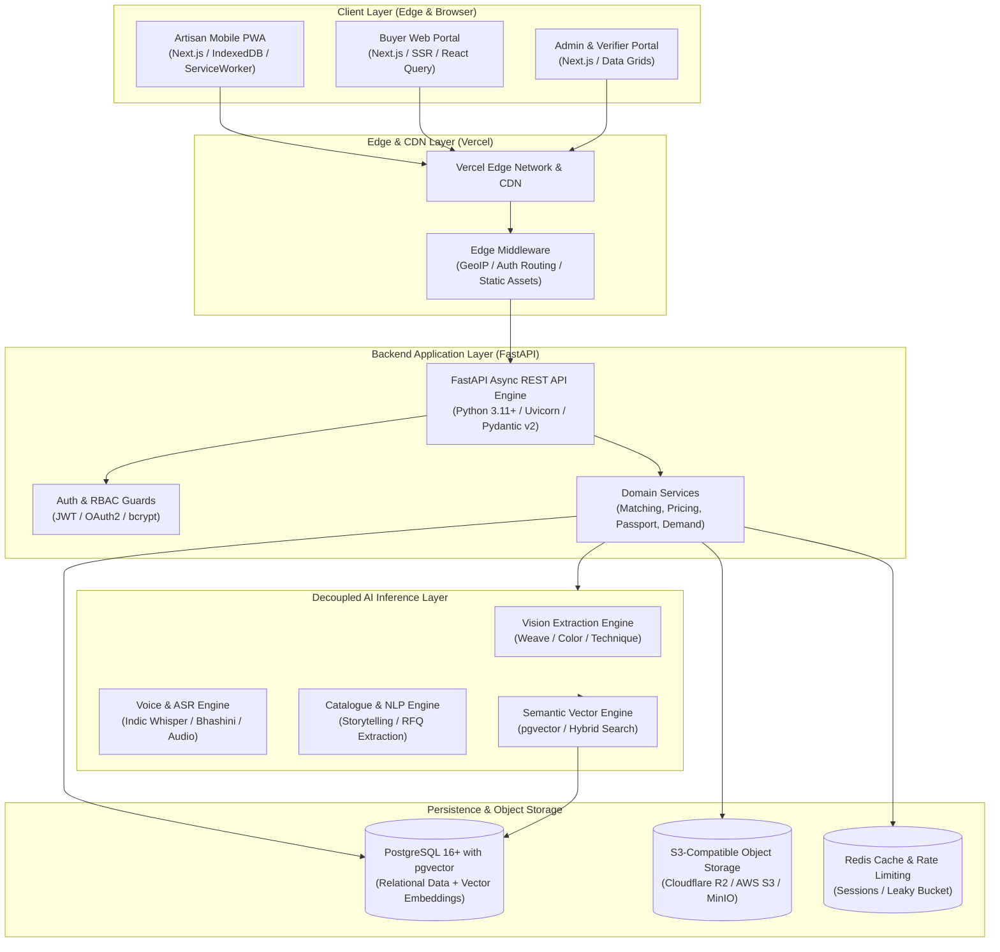
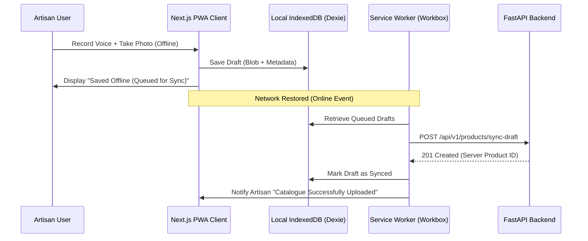
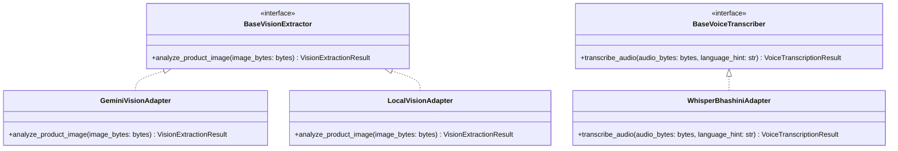
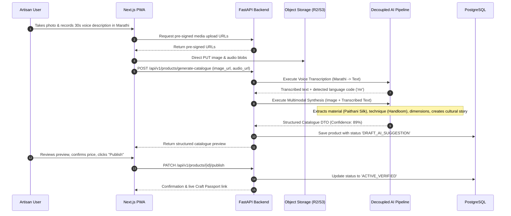
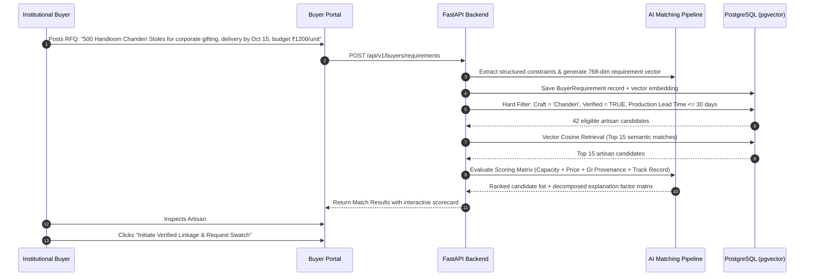

# SIH 26090: System Architecture & Technical Specification
## Modular, Production-Grade Architecture for Artisan Market Linkage

---

## 1. System Architecture Overview

The SIH 26090 platform adopts a decoupled, multi-tier modular architecture designed for high availability, independent service scalability, and robust edge resilience in low-connectivity rural environments.



---

## 2. Frontend Architecture (Next.js 14+ / TypeScript)

### 2.1 Technology Stack & Decisions
- **Framework**: Next.js 14+ with App Router (`frontend/src/app`). Server Components (RSC) are utilized for high-performance public craft catalogues and buyer discovery, while Client Components (`'use client'`) power interactive artisan tools.
- **Language**: TypeScript with strict mode enabled (`noImplicitAny`, `strictNullChecks`).
- **Styling**: TailwindCSS with CSS variables for responsive theme customization, accessible color contrast ratios (WCAG 2.1 AA), and fluid typography.
- **State Management**:
  - **Zustand**: Lightweight global stores for client sessions, active language preference, and the draft listing creator.
  - **TanStack React Query v5**: Server state management, optimistic UI updates, background caching, and automatic request deduplication.
- **Audio Capture**: Browser Web Audio API (`MediaRecorder`) configured to capture low-bitrate compressed Opus/WebM audio for rural voice uploads.

### 2.2 PWA & Offline Engine Architecture
Rural artisan clusters frequently experience 2G/3G network drops. The frontend implements a robust Progressive Web App (PWA) layer:
- **Service Worker (`sw.js`)**: Built with Google Workbox.
  - *Cache-First Strategy*: Applied to static UI bundles, Google Fonts, and core SVG craft iconography.
  - *Network-First with Cache Fallback*: Applied to the artisan's personal catalogue and active buyer enquiries.
  - *Background Sync*: Intercepts failed POST/PUT requests (e.g., draft catalogue uploads) and queues them for automated replay when the browser detects network restoration.
- **IndexedDB (`Dexie.js`)**: Client-side storage storing:
  - Draft product listings (images stored as local Blobs).
  - Voice audio recordings waiting for transcription.
  - Cached list of recognized crafts and material categories for offline dropdown selections.



---

## 3. Backend Architecture (FastAPI / Python 3.11+)

### 3.1 Clean Architecture / Domain-Driven Design
The backend is structured to ensure that business logic remains completely independent of database technology, web frameworks, and third-party AI APIs:

```
backend/app/
├── api/
│   └── v1/
│       ├── endpoints/
│       │   ├── auth.py           # JWT registration, login, phone OTP verification
│       │   ├── artisans.py       # Artisan profile, craft passport, KYC documents
│       │   ├── buyers.py         # Buyer profile, preferences, requirement postings (RFQ)
│       │   ├── products.py       # Product catalogue, image upload, draft persistence
│       │   ├── matches.py        # Smart matching queries, scorecard evaluations
│       │   ├── pricing.py        # Fair-price calculations, cost breakdowns
│       │   ├── demand.py         # Demand intelligence signals, festival trend indicators
│       │   ├── orders.py         # Enquiry lifecycle, swatch requests, escrow status
│       │   └── admin.py          # Verifications, moderation, audit trail, analytics
│       └── router.py             # Global v1 aggregation
├── core/
│   ├── config.py                 # Pydantic v2 Settings (environment validation)
│   ├── database.py               # Async SQLAlchemy 2.0 session factory
│   ├── security.py               # Password hashing (bcrypt), JWT generation/validation
│   ├── permissions.py            # RBAC dependency decorators
│   ├── telemetry.py              # Prometheus metrics & structured JSON logger
│   └── exceptions.py             # Custom API exceptions and global handlers
├── models/                       # Declarative SQLAlchemy 2.0 ORM models
├── schemas/                      # Pydantic v2 DTOs (Request / Response validation)
├── services/                     # Pure domain logic (MatchingService, PricingEngine, etc.)
├── repositories/                 # Data access layer (Async CRUD operations)
└── integrations/                 # External service clients (S3/R2 storage, SMS, WhatsApp)
```

### 3.2 Dependency Injection & Service Layer Decoupling
FastAPI's dependency injection (`Depends`) is leveraged throughout:
- Database sessions (`get_async_db`) are scoped per request with automated rollback on unhandled exceptions.
- Current authenticated user (`get_current_active_user`) automatically validates JWT claims and enforces RBAC roles.
- AI services are injected via abstract interfaces (`BaseVisionClient`, `BaseVoiceClient`), allowing mock implementations in local test environments and production endpoints in deployment.

---

## 4. Database Architecture (PostgreSQL 16+ with pgvector)

### 4.1 Extensions Utilized
- **`uuid-ossp`**: Standardized UUIDv4 primary keys across all entities to prevent enumeration attacks and support distributed ID generation.
- **`pgvector`**: Native vector storage and indexing for 768-dimensional embeddings (matching buyer requirements with artisan craft profiles).
- **`pg_trgm`**: Trigram matching for high-performance fuzzy text search across artisan names, craft categories, and regional cluster names.

### 4.2 Indexing Strategy
- **B-Tree Indexes**: Applied to all foreign keys (`artisan_id`, `craft_id`, `buyer_id`), lookup codes (`pehchan_id`, `gi_tag_code`), and timestamp filters (`created_at`).
- **GIN Indexes**: Applied to JSONB attributes (`product_attributes`, `match_explanation_json`, `provenance_metadata`).
- **HNSW (Hierarchical Navigable Small World) Indexes**: Applied to `embedding` vector columns in `products` and `buyer_requirements` using cosine similarity (`vector_cosine_ops`), enabling sub-50ms nearest-neighbor retrieval over hundreds of thousands of vectors.

---

## 5. AI Integration Layer & Pluggable Adapter Pattern

The AI layer is architected as an independent domain package (`ai/`) isolated from backend web routing. 



### 5.1 Resilient Fallbacks & Circuit Breakers
To prevent external AI provider downtime from halting core platform operations:
1. **Timeout Bounds**: Every AI inference call has a strict 8-second timeout.
2. **Circuit Breaker**: If 3 consecutive AI requests fail, the circuit breaker opens for 60 seconds, instantly routing requests to the local heuristic fallback.
3. **Graceful Fallback**:
   - If Voice ASR fails: The system prompts the artisan with a structured 3-step icon-based form.
   - If Image Vision fails: The system uses standard craft category templates and prompts the artisan to confirm material and dimensions.

---

## 6. Object Storage & Media Processing Architecture

### 6.1 S3-Compatible Storage (Cloudflare R2 / AWS S3 / MinIO)
Media files (product photographs, audio recordings, artisan KYC identity proofs, craft passport QR codes) are stored in an S3-compatible bucket with strict access separation:
- **Public Read Bucket (`artisan-media-public`)**: WebP product photographs and public Craft Passport verification badges served via a global CDN.
- **Private Encrypted Bucket (`artisan-documents-private`)**: Artisan government identity documents (Aadhaar, Pehchan ID, bank statements) encrypted at rest (AES-256), accessible only via time-limited (15-minute) pre-signed URLs generated for authorized Admin verifiers.

### 6.2 Direct Client-to-Storage Upload Pipeline
To avoid loading high-resolution image uploads through the FastAPI server memory:
1. Client requests a pre-signed PUT URL from `POST /api/v1/products/media/presign-upload`.
2. Backend validates file type (magic bytes), file size limit (< 10MB), and returns a pre-signed URL with a unique UUID key.
3. Client uploads the file directly to Object Storage.
4. Client notifies backend `POST /api/v1/products/media/confirm-upload` to trigger background image optimization (WebP conversion and thumbnail generation).

---

## 7. High-Level Data Flow Diagrams

### 7.1 Flow 1: Multimodal Catalogue Creation (Photo + Voice)



### 7.2 Flow 2: Buyer RFQ to Explainable Match Pipeline



---

## 8. Summary of Architectural Decisions

| Decision Area | Chosen Architecture | Rationale & Benefit |
|---|---|---|
| **Repository Model** | Monorepo (`frontend`, `backend`, `ai`, `data`, `docs`) | Shared domain types, unified versioning, atomic CI/CD testing across components |
| **Frontend Framework** | Next.js 14+ App Router (TypeScript) | SSR for SEO-optimized buyer craft discovery; React Client Components for artisan PWA |
| **API Framework** | FastAPI (Python 3.11+) | Asynchronous I/O performance, native Pydantic v2 validation, seamless integration with Python AI packages |
| **Database** | PostgreSQL 16+ with `pgvector` | Unified relational ACID integrity and high-performance vector semantic search in one engine |
| **AI Decoupling** | Separate `ai/` adapter layer with strict DTOs | Enables switching between local open-source models and cloud LLMs without altering backend business logic |
| **Offline Resilience** | Workbox PWA + Dexie.js (IndexedDB) | Ensures rural artisans can draft listings and capture recordings without internet connectivity |
| **Media Pipeline** | Direct-to-S3 Pre-signed Uploads | Avoids web server memory saturation; offloads high-resolution images to CDN |
