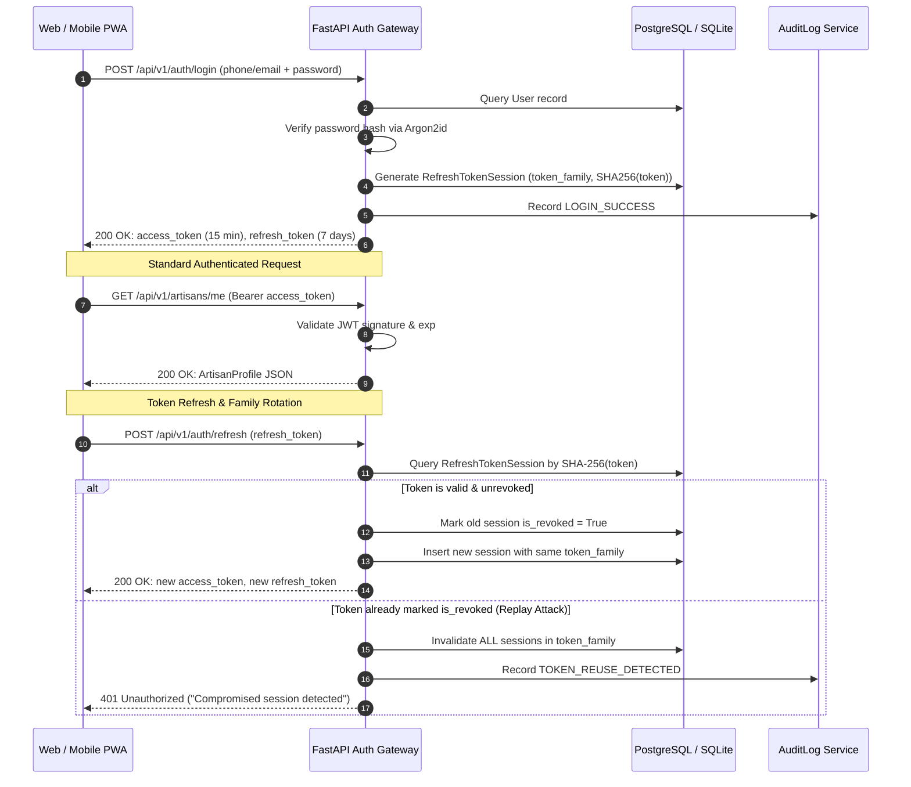

# SIH 26090: Authentication & Identity Architecture
## Dual-Mode Identity, Argon2id Password Hashing, Refresh Token Rotation & OTP Verification

---

## 1. Architectural Philosophy

Identity management in **SIH 26090** solves a dual-demographic reality:
1. **Rural Artisans**: May lack email addresses, high-speed connectivity, or complex password recall capabilities. Require seamless, low-bandwidth, passwordless mobile OTP verification.
2. **Institutional & B2B Buyers / Administrators**: Require corporate credential management, email verification, strict session lifetimes, and enterprise auditability.

To fulfill both models securely, the platform implements a dual-mode identity architecture built atop **Argon2id** password hashing, **HMAC-SHA256 signed JWTs**, **Cryptographic Refresh Token Rotation with Token Family Reuse Detection**, and **Secure In-Memory/Database OTP Challenges**.

---

## 2. Password Hashing: Argon2id Specification

All user passwords are encrypted using **Argon2id**, the winner of the Password Hashing Competition (PHC) and recommended standard by OWASP:
- **Variant**: `Argon2id` (hybrid of Argon2d and Argon2i, defending against side-channel and GPU-based brute-force attacks).
- **Time Cost (Iterations)**: `3`
- **Memory Cost**: `65536 KiB` (64 MiB)
- **Parallelism**: `4` threads
- **Salt Generation**: Cryptographically secure random 16-byte salt per hash.

```python
# backend/app/core/security.py
_ph = PasswordHasher(
    time_cost=3,
    memory_cost=65536,
    parallelism=4,
    hash_len=32,
    salt_len=16
)
```

Passwords are never logged, decrypted, or transmitted in plain text across logs or database tables.

---

## 3. JWT Access Token & Refresh Session Lifecycle



### 3.1 Access Token Structure
- **Algorithm**: `HS256` (configured via `SECRET_KEY`).
- **TTL**: 15 minutes (`ACCESS_TOKEN_EXPIRE_MINUTES`).
- **Payload Claims**:
  - `sub`: User UUID (`id`).
  - `role`: Role string (`artisan`, `buyer`, `admin`).
  - `iat`: Epoch issuance timestamp.
  - `exp`: Epoch expiration timestamp.
  - `jti`: 16-byte random unique token identifier (defends against replay within the 15-minute window).

### 3.2 Refresh Token Rotation & Theft Defense
To prevent refresh token theft:
1. Refresh tokens are 48-byte URL-safe cryptographic random strings.
2. Only the **SHA-256 hash** of the refresh token is stored in the `refresh_token_sessions` table.
3. Every refresh request rotates the token: the old token is marked `is_revoked = True`, and a new token is generated under the identical `token_family` identifier.
4. **Token Reuse Detection**: If an already revoked refresh token is presented again (e.g. an attacker attempting to use an intercepted token after the legitimate user refreshed), the system immediately detects family reuse, revokes all sessions belonging to that `token_family`, and logs a security incident in `audit_logs`.

---

## 4. Passwordless Mobile OTP Flow

To serve rural artisans with low digital literacy:
1. **Request Challenge**: `POST /api/v1/auth/otp/request` with E.164 phone number.
   - Generates a cryptographically secure 6-digit numeric OTP code.
   - Saves SHA-256 hash of the code in `otp_challenges` with 5-minute TTL.
   - Limits rate to 3 attempts per challenge.
2. **Verify Challenge**: `POST /api/v1/auth/otp/verify` with phone number and 6-digit code.
   - Compares SHA-256 hash of the submitted code.
   - Marks challenge `is_consumed = True`.
   - If user does not exist yet, auto-provisions an active `artisan` user.
   - Issues initial access token and refresh token session.

---

## 5. API Endpoints Reference

| Endpoint | Method | Role Required | Description |
|---|---|---|---|
| `/api/v1/auth/register` | `POST` | Public | Registers artisan or buyer account with Argon2id password hashing |
| `/api/v1/auth/login` | `POST` | Public | Authenticates via phone or email, issues token pair |
| `/api/v1/auth/refresh` | `POST` | Public | Rotates refresh token with reuse attack detection |
| `/api/v1/auth/logout` | `POST` | Authenticated | Revokes active refresh token session |
| `/api/v1/auth/otp/request` | `POST` | Public | Generates 5-minute passwordless numeric OTP challenge |
| `/api/v1/auth/otp/verify` | `POST` | Public | Verifies OTP code, auto-provisions user, issues token pair |
| `/api/v1/auth/me` | `GET` | Authenticated | Returns identity profile of the authenticated user |
