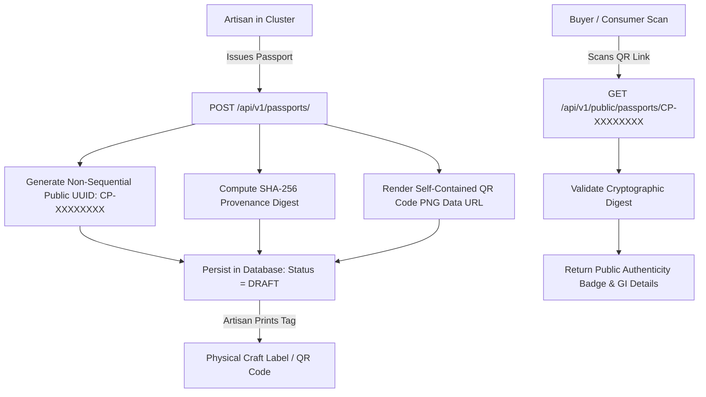
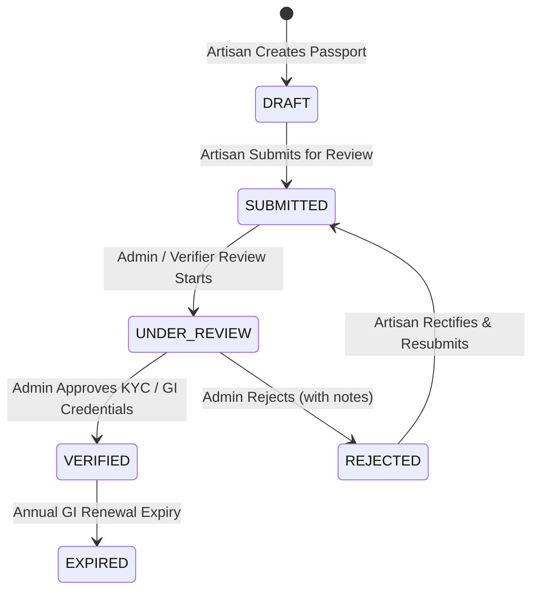

# SIH 26090: Digital Craft Passport & Provenance System
## Non-Sequential Identifier Generation, Cryptographic Hashing, Embedded QR Codes & Public Verification

---

## 1. Concept & Problem Definition

In traditional Indian handicrafts, counterfeit factory reproductions (e.g. powerloom textiles sold as handloom Chanderi or synthetic prints marketed as hand-block Bagru) erode artisan earnings and mislead consumers.

The **Digital Craft Passport** provides a verifiable, tamper-evident cryptographic provenance anchor that:
1. Links the physical artifact to the registered artisan and certified GI cluster.
2. Embeds an offline-friendly, self-contained QR code on physical product tags.
3. Allows any buyer, consumer, or retail curator to scan the QR code and instantly verify authenticity without requiring an account or exposing artisan PII.

---

## 2. Technical Architecture



### 2.1 Non-Sequential Identifier Generation
To defend against serial enumeration attacks:
- The public passport UUID is generated as `CP-` followed by an 8-byte (16 hex character) cryptographically random uppercase token:
  ```python
  public_id = f"CP-{secrets.token_hex(8).upper()}"
  # Example: CP-FE7054110FD37600
  ```

### 2.2 Cryptographic Provenance Hash
Every passport contains a deterministic SHA-256 digest binding the issuing artisan, craft ID, public UUID, and GI tag number:
```python
provenance_payload = f"{artisan.id}:{craft.id}:{public_id}:{craft.gi_tag_number or 'NO_GI'}"
provenance_hash = hashlib.sha256(provenance_payload.encode("utf-8")).hexdigest()
```
This tamper-evident digest enables verification that the passport was not forged or detached from its registered craft entity.

### 2.3 Self-Contained QR Code Generation
QR codes are dynamically generated server-side using `qrcode[pil]` and returned as embedded base64 PNG data URLs (`data:image/png;base64,...`).
- **No Third-Party Hosting**: QR codes do not depend on external image hosting services (e.g. AWS S3 or Cloudinary) for basic generation, ensuring offline compatibility, test determinism, and zero external latency.
- **Embedded Palette**: Rendered in warm amber branding (`#78350f` on `#fdfbf7`).

---

## 3. Passport State Machine

A Craft Passport progresses through strict lifecycle states:



1. `DRAFT`: Initial draft created by artisan; QR code generated and previewable.
2. `SUBMITTED`: Artisan initiates formal verification review.
3. `UNDER_REVIEW`: Triggered when KYC documents or GI certificates are pending admin inspection.
4. `VERIFIED`: Official validation granted; badge displayed publicly.
5. `REJECTED`: Criteria unmet or documents illegible.
6. `EXPIRED`: Certificate validity period elapsed.

---

## 4. Public Verification Endpoint

#### `GET /api/v1/public/passports/{public_id}`
- **Authentication**: None (open to all consumers and buyers).
- **Security Boundary**: Returns public provenance details while strictly withholding personal contact info, home addresses, or financial data.
- **Sample Response**:
  ```json
  {
    "passport_uuid": "CP-FE7054110FD37600",
    "status": "VERIFIED",
    "verification_level": "GOVERNMENT_VERIFIED_GI",
    "issued_at": "2026-03-26T21:14:53.676000+00:00",
    "artisan_public_name": "Kailash Weavers",
    "craft_name": "Chanderi Silk Saree",
    "origin_state": "Madhya Pradesh",
    "origin_district": "Ashoknagar",
    "gi_tag_number": "GI-007",
    "has_gi_tag": true,
    "cultural_heritage_description": "Traditional sheer weave with zari border.",
    "traditional_raw_materials": ["Silk", "Cotton", "Zari"],
    "provenance_hash": "e3b0c44298fc1c149afbf4c8996fb92427ae41e4649b934ca495991b7852b855",
    "is_valid": true,
    "provenance_metadata": {}
  }
  ```
