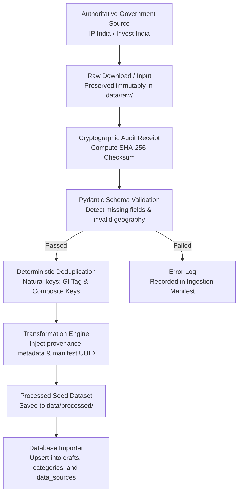

# SIH 26090: Reusable Data Ingestion Pipeline Architecture
## Ingestion Lifecycle, Anomaly Detection & Deduplication Engine

---

## 1. Pipeline Architecture



---

## 2. Execution Guide

To run the complete data ingestion pipeline across all configured adapters:

```bash
# Execute pipeline runner
python scripts/ingestion/run_ingestion.py
```

### Generated Artifacts
1. **Raw Files**: Written directly to `data/raw/` with zero manual tampering.
2. **Audit Manifests**: Saved as JSON in `data/manifests/manifest_{source}_{timestamp}.json`.
3. **Normalized Seeds**: Written to `data/processed/` ready for database ingestion.

---

## 3. Adding a New Ingestion Adapter

All new data source adapters must inherit from `scripts/ingestion/common/base_adapter.py` and implement the 6 abstract methods:
- `source_id`, `source_name`, `source_url`, `custodian`, `license_type`
- `load_raw_data() -> Tuple[str, str]`
- `parse_raw(raw_content: str) -> List[Dict[str, Any]]`
- `validate_records(records: List[Dict[str, Any]]) -> Tuple[List, List]`
- `deduplicate(records: List[Dict[str, Any]]) -> Tuple[List, int]`
- `transform(records: List[Dict[str, Any]], manifest_id: str) -> List[Dict[str, Any]]`
