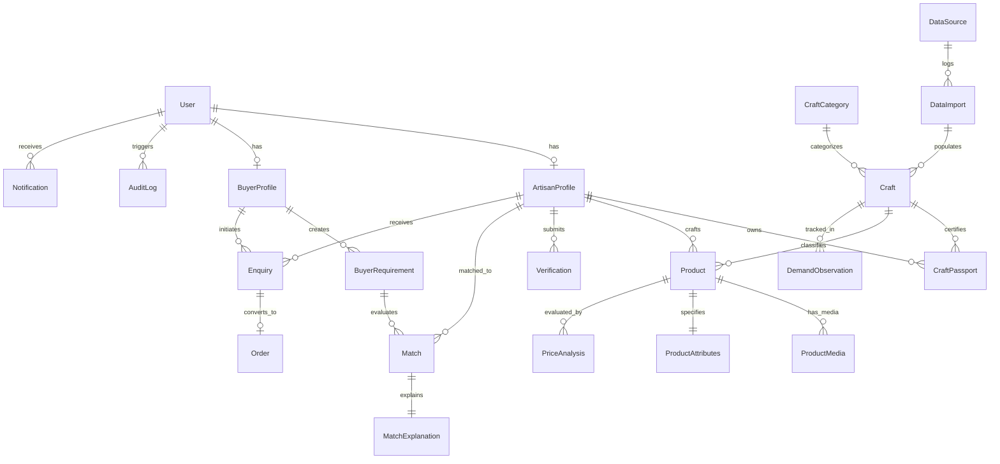

# SIH 26090: Data Strategy, Provenance & Relational Schema
## Real-Data Acquisition, Verification Framework & Complete Entity Design

---

## 1. Real Data Policy & Sourcing Framework

### 1.1 Zero-Fabrication Mandate
The SIH 26090 platform enforces a strict **Zero-Fabrication Policy**. Fabricating artisan identities, government scheme registrations, Geographical Indication (GI) tags, consumer reviews, or fictitious price histories is strictly prohibited. The integrity of the platform rests entirely on authentic data.

### 1.2 Identified Legitimate Public Data Sources

| Source Entity | Official Custodian | Target Data Extracted | Usage in SIH 26090 Platform |
|---|---|---|---|
| **GI Registry of India** | Intellectual Property India (DPIIT), Ministry of Commerce | 400+ registered Handicraft and Handloom GI tags, registration numbers, cluster boundaries, authorized user lists | Verifies authentic craft provenance in Craft Passport (`Craft`, `CraftPassport`) |
| **ODOP (One District One Product)** | DPIIT / Invest India | 750+ districts mapped to indigenous crafts, raw material availability, nodal state agencies | Grounds geographical cluster matching and cluster-level capacity calculation |
| **Ministry of Textiles (DC Handicrafts)** | Ministry of Textiles, Govt. of India | National Handicrafts Clusters, Mega Cluster locations, Master Craftspersons National Awardee records | Benchmark validation for master artisan verification (`Verification`, `Craft`) |
| **National Handloom Census** | Ministry of Textiles / data.gov.in | Loom type distribution, active weaver working days, baseline wage ranges | Provides empirical baseline for Fair-Price labor hour calculations (`PriceAnalysis`) |
| **Wholesale Raw Material Indices** | Central Silk Board, Cotton Corporation of India, Ministry of Textiles | Historical and current market rates for Mulberry Silk, Tussar, Eri, Muga, Combed Cotton, Brass, Bell Metal | Live/periodic cost benchmarking for fair raw material calculations (`PriceAnalysis`) |
| **GeM / ONDC Craft Taxonomy** | Open Network for Digital Commerce & Government e-Marketplace | Standardized product categorization, HSN codes, packaging, and shipping standards | Aligns buyer requirements and catalogue attributes with national digital commerce standards |

---

## 2. Provenance Metadata Architecture

Every external data point imported into the database maintains an immutable provenance header to ensure complete traceability.

```json
{
  "provenance_metadata": {
    "source_id": "DS-GI-INDIA-2024",
    "source_name": "Geographical Indications Registry of India",
    "source_url": "https://ipindia.gov.in/registered-gls.htm",
    "source_record_id": "GI-AP-HANDICRAFTS-104",
    "retrieval_date": "2026-03-15T10:30:00Z",
    "dataset_version": "v2025.4",
    "verification_status": "OFFICIALLY_VERIFIED",
    "license": "Government Open Data License - India (GODL)",
    "is_sample_or_demo": false
  }
}
```

### 2.1 Demo & Sample Data Segregation
For local testing and judge demonstration flows where live private artisan records are not available:
1. Every table contains an explicit boolean flag: `is_sample_or_demo: boolean NOT NULL DEFAULT false`.
2. Any record flagged `is_sample_or_demo = true` is permanently displayed with a conspicuous UI badge:  
   `[DEMO / SAMPLE RECORD - NOT VERIFIED BY MINISTRY]`.
3. Sample records are strictly excluded from aggregated platform analytics, official demand intelligence, and public benchmark calculations.

---

## 3. Comprehensive Database Schema & Entity Design

The database schema is organized around 23 core entities implemented in PostgreSQL 16+ with the `pgvector` extension.



---

### Detailed Entity Specifications

#### 1. `users`
- **Purpose**: Central authentication and user identity table for all platform participants.
- **Fields**:
  - `id`: `UUID` (PK, default `uuid_generate_v4()`)
  - `phone_number`: `VARCHAR(15)` (UNIQUE, NOT NULL, E.164 format)
  - `email`: `VARCHAR(255)` (UNIQUE, NULLABLE)
  - `password_hash`: `VARCHAR(255)` (NOT NULL, bcrypt)
  - `role`: `VARCHAR(30)` (NOT NULL, ENUM: `artisan`, `buyer`, `admin`, `verifier`)
  - `preferred_language`: `VARCHAR(10)` (NOT NULL DEFAULT `'en'`)
  - `is_active`: `BOOLEAN` (NOT NULL DEFAULT `true`)
  - `is_verified`: `BOOLEAN` (NOT NULL DEFAULT `false`)
  - `created_at`: `TIMESTAMPTZ` (NOT NULL DEFAULT `NOW()`)
  - `updated_at`: `TIMESTAMPTZ` (NOT NULL DEFAULT `NOW()`)
- **Indexes**: `CREATE INDEX idx_users_phone ON users(phone_number);`, `CREATE INDEX idx_users_role ON users(role);`
- **Constraints**: Phone number regex constraint (`^\+[1-9]\d{1,14}$`).

#### 2. `roles`
- **Purpose**: Defines granular role-based permissions and capabilities.
- **Fields**:
  - `id`: `INTEGER` (PK, SERIAL)
  - `name`: `VARCHAR(50)` (UNIQUE, NOT NULL)
  - `description`: `TEXT`
  - `permissions_json`: `JSONB` (NOT NULL DEFAULT `'[]'`)

#### 3. `artisan_profiles`
- **Purpose**: Comprehensive profile, cooperative membership, location, and capacity data for artisans.
- **Fields**:
  - `id`: `UUID` (PK, default `uuid_generate_v4()`)
  - `user_id`: `UUID` (FK -> `users.id`, UNIQUE, NOT NULL)
  - `full_name`: `VARCHAR(150)` (NOT NULL)
  - `cooperative_name`: `VARCHAR(200)` (NULLABLE)
  - `state`: `VARCHAR(100)` (NOT NULL)
  - `district`: `VARCHAR(100)` (NOT NULL)
  - `pincode`: `VARCHAR(10)` (NOT NULL)
  - `address_line`: `TEXT` (NULLABLE)
  - `latitude`: `DECIMAL(10, 7)` (NULLABLE)
  - `longitude`: `DECIMAL(10, 7)` (NULLABLE)
  - `primary_craft_id`: `UUID` (FK -> `crafts.id`, NOT NULL)
  - `years_of_experience`: `INTEGER` (NOT NULL DEFAULT 1)
  - `monthly_production_capacity`: `INTEGER` (NOT NULL DEFAULT 10)
  - `pehchan_id`: `VARCHAR(50)` (UNIQUE, NULLABLE)
  - `verification_status`: `VARCHAR(30)` (NOT NULL DEFAULT `'PENDING'`)
  - `is_sample_or_demo`: `BOOLEAN` (NOT NULL DEFAULT `false`)
  - `created_at`: `TIMESTAMPTZ` (NOT NULL DEFAULT `NOW()`)
  - `updated_at`: `TIMESTAMPTZ` (NOT NULL DEFAULT `NOW()`)
- **Indexes**: `CREATE INDEX idx_artisan_district ON artisan_profiles(state, district);`, `CREATE INDEX idx_artisan_craft ON artisan_profiles(primary_craft_id);`

#### 4. `craft_categories`
- **Purpose**: High-level classification of craft disciplines (e.g., Handloom Textiles, Metalware, Pottery, Woodcraft).
- **Fields**:
  - `id`: `UUID` (PK, default `uuid_generate_v4()`)
  - `name`: `VARCHAR(100)` (UNIQUE, NOT NULL)
  - `description`: `TEXT`
  - `icon_url`: `TEXT`
  - `created_at`: `TIMESTAMPTZ` (NOT NULL DEFAULT `NOW()`)

#### 5. `crafts`
- **Purpose**: Detailed master directory of Indian crafts mapped to official GI registry and ODOP records.
- **Fields**:
  - `id`: `UUID` (PK, default `uuid_generate_v4()`)
  - `category_id`: `UUID` (FK -> `craft_categories.id`, NOT NULL)
  - `name`: `VARCHAR(150)` (UNIQUE, NOT NULL)
  - `gi_tag_number`: `VARCHAR(50)` (UNIQUE, NULLABLE)
  - `has_gi_tag`: `BOOLEAN` (NOT NULL DEFAULT `false`)
  - `origin_state`: `VARCHAR(100)` (NOT NULL)
  - `origin_district`: `VARCHAR(100)` (NOT NULL)
  - `cultural_heritage_description`: `TEXT` (NOT NULL)
  - `traditional_raw_materials`: `JSONB` (NOT NULL DEFAULT `'[]'`)
  - `data_source_id`: `UUID` (FK -> `data_sources.id`, NULLABLE)
  - `is_sample_or_demo`: `BOOLEAN` (NOT NULL DEFAULT `false`)
- **Indexes**: `CREATE INDEX idx_crafts_gi ON crafts(gi_tag_number);`, `CREATE INDEX idx_crafts_origin ON crafts(origin_state, origin_district);`

#### 6. `craft_passports`
- **Purpose**: Tamper-evident digital provenance passport documenting an artisan's verified lineage and craft certification.
- **Fields**:
  - `id`: `UUID` (PK, default `uuid_generate_v4()`)
  - `artisan_id`: `UUID` (FK -> `artisan_profiles.id`, NOT NULL)
  - `craft_id`: `UUID` (FK -> `crafts.id`, NOT NULL)
  - `passport_uuid`: `VARCHAR(64)` (UNIQUE, NOT NULL)
  - `qr_code_url`: `TEXT` (NOT NULL)
  - `authorized_user_gi_certificate`: `TEXT` (NULLABLE)
  - `verification_level`: `VARCHAR(30)` (NOT NULL DEFAULT `'SELF_DECLARED'`, ENUM: `SELF_DECLARED`, `COOPERATIVE_VERIFIED`, `GOVERNMENT_VERIFIED_GI`)
  - `issued_at`: `TIMESTAMPTZ` (NOT NULL DEFAULT `NOW()`)
  - `expires_at`: `TIMESTAMPTZ` (NULLABLE)
  - `provenance_hash`: `VARCHAR(64)` (NOT NULL)
  - `is_sample_or_demo`: `BOOLEAN` (NOT NULL DEFAULT `false`)
- **Indexes**: `CREATE INDEX idx_passport_uuid ON craft_passports(passport_uuid);`

#### 7. `products`
- **Purpose**: Specific craft items created by an artisan, containing multimodal descriptions and catalogue data.
- **Fields**:
  - `id`: `UUID` (PK, default `uuid_generate_v4()`)
  - `artisan_id`: `UUID` (FK -> `artisan_profiles.id`, NOT NULL)
  - `craft_id`: `UUID` (FK -> `crafts.id`, NOT NULL)
  - `title`: `VARCHAR(255)` (NOT NULL)
  - `storytelling_description`: `TEXT` (NOT NULL)
  - `ai_generated_description`: `TEXT` (NULLABLE)
  - `is_ai_description_confirmed`: `BOOLEAN` (NOT NULL DEFAULT `false`)
  - `price_inr`: `DECIMAL(10, 2)` (NOT NULL)
  - `estimated_production_days`: `INTEGER` (NOT NULL DEFAULT 7)
  - `stock_quantity`: `INTEGER` (NOT NULL DEFAULT 1)
  - `is_customizable`: `BOOLEAN` (NOT NULL DEFAULT `false`)
  - `embedding`: `vector(768)` (NULLABLE, semantic embedding for search)
  - `status`: `VARCHAR(30)` (NOT NULL DEFAULT `'DRAFT'`, ENUM: `DRAFT`, `PENDING_REVIEW`, `ACTIVE`, `INACTIVE`)
  - `is_sample_or_demo`: `BOOLEAN` (NOT NULL DEFAULT `false`)
  - `created_at`: `TIMESTAMPTZ` (NOT NULL DEFAULT `NOW()`)
  - `updated_at`: `TIMESTAMPTZ` (NOT NULL DEFAULT `NOW()`)
- **Indexes**: 
  - `CREATE INDEX idx_products_artisan ON products(artisan_id);`
  - `CREATE INDEX idx_products_craft ON products(craft_id);`
  - `CREATE INDEX idx_products_embedding ON products USING hnsw (embedding vector_cosine_ops);`

#### 8. `product_media`
- **Purpose**: Photographs, high-resolution detail shots, and audio voice descriptions associated with a product.
- **Fields**:
  - `id`: `UUID` (PK, default `uuid_generate_v4()`)
  - `product_id`: `UUID` (FK -> `products.id`, NOT NULL)
  - `media_type`: `VARCHAR(20)` (NOT NULL, ENUM: `IMAGE`, `AUDIO_VOICE_NOTE`, `DOCUMENT`)
  - `url`: `TEXT` (NOT NULL)
  - `thumbnail_url`: `TEXT` (NULLABLE)
  - `original_filename`: `VARCHAR(255)` (NOT NULL)
  - `file_size_bytes`: `INTEGER` (NOT NULL)
  - `mime_type`: `VARCHAR(50)` (NOT NULL)
  - `is_primary`: `BOOLEAN` (NOT NULL DEFAULT `false`)
  - `created_at`: `TIMESTAMPTZ` (NOT NULL DEFAULT `NOW()`)

#### 9. `product_attributes`
- **Purpose**: Granular, structured technical specifications of a craft product.
- **Fields**:
  - `id`: `UUID` (PK, default `uuid_generate_v4()`)
  - `product_id`: `UUID` (FK -> `products.id`, UNIQUE, NOT NULL)
  - `primary_material`: `VARCHAR(100)` (NOT NULL)
  - `technique`: `VARCHAR(100)` (NOT NULL)
  - `dimensions_cm`: `JSONB` (NULLABLE, e.g., `{"length": 200, "width": 100, "height": null}`)
  - `weight_grams`: `INTEGER` (NULLABLE)
  - `colors`: `JSONB` (NOT NULL DEFAULT `'[]'`)
  - `care_instructions`: `TEXT` (NULLABLE)
  - `ai_confidence_score`: `DECIMAL(4, 3)` (NULLABLE)
  - `raw_attributes_json`: `JSONB` (NOT NULL DEFAULT `'{}'`)

#### 10. `buyer_profiles`
- **Purpose**: Profile and procurement profile for institutional, retail, or export buyers.
- **Fields**:
  - `id`: `UUID` (PK, default `uuid_generate_v4()`)
  - `user_id`: `UUID` (FK -> `users.id`, UNIQUE, NOT NULL)
  - `company_name`: `VARCHAR(200)` (NOT NULL)
  - `buyer_type`: `VARCHAR(50)` (NOT NULL, ENUM: `RETAIL_CURATOR`, `INSTITUTIONAL_GIFTING`, `GOVERNMENT_GEM`, `EXPORT_AGGREGATOR`)
  - `gstin`: `VARCHAR(20)` (NULLABLE)
  - `country`: `VARCHAR(100)` (NOT NULL DEFAULT `'India'`)
  - `state`: `VARCHAR(100)` (NULLABLE)
  - `typical_order_volume`: `VARCHAR(50)` (NULLABLE)
  - `is_verified_buyer`: `BOOLEAN` (NOT NULL DEFAULT `false`)
  - `is_sample_or_demo`: `BOOLEAN` (NOT NULL DEFAULT `false`)

#### 11. `buyer_requirements` (RFQs)
- **Purpose**: Formal buyer requirements or Requests for Quotation (RFQs) submitted for artisan matching.
- **Fields**:
  - `id`: `UUID` (PK, default `uuid_generate_v4()`)
  - `buyer_id`: `UUID` (FK -> `buyer_profiles.id`, NOT NULL)
  - `title`: `VARCHAR(255)` (NOT NULL)
  - `raw_text`: `TEXT` (NOT NULL)
  - `target_craft_id`: `UUID` (FK -> `crafts.id`, NULLABLE)
  - `required_quantity`: `INTEGER` (NOT NULL)
  - `target_unit_price_inr`: `DECIMAL(10, 2)` (NULLABLE)
  - `max_budget_inr`: `DECIMAL(12, 2)` (NULLABLE)
  - `deadline_date`: `DATE` (NOT NULL)
  - `requires_gi_certification`: `BOOLEAN` (NOT NULL DEFAULT `false`)
  - `material_constraints`: `JSONB` (NOT NULL DEFAULT `'[]'`)
  - `embedding`: `vector(768)` (NULLABLE, requirement vector)
  - `status`: `VARCHAR(30)` (NOT NULL DEFAULT `'OPEN'`, ENUM: `OPEN`, `MATCHED`, `CLOSED`)
  - `created_at`: `TIMESTAMPTZ` (NOT NULL DEFAULT `NOW()`)
- **Indexes**: 
  - `CREATE INDEX idx_req_buyer ON buyer_requirements(buyer_id);`
  - `CREATE INDEX idx_req_embedding ON buyer_requirements USING hnsw (embedding vector_cosine_ops);`

#### 12. `matches`
- **Purpose**: Evaluated match score connecting a buyer requirement to an artisan profile.
- **Fields**:
  - `id`: `UUID` (PK, default `uuid_generate_v4()`)
  - `requirement_id`: `UUID` (FK -> `buyer_requirements.id`, NOT NULL)
  - `artisan_id`: `UUID` (FK -> `artisan_profiles.id`, NOT NULL)
  - `composite_score`: `DECIMAL(5, 4)` (NOT NULL, range 0.0000 - 1.0000)
  - `semantic_similarity`: `DECIMAL(5, 4)` (NOT NULL)
  - `capacity_compatibility`: `DECIMAL(5, 4)` (NOT NULL)
  - `price_compatibility`: `DECIMAL(5, 4)` (NOT NULL)
  - `lead_time_compatibility`: `DECIMAL(5, 4)` (NOT NULL)
  - `provenance_bonus`: `DECIMAL(5, 4)` (NOT NULL)
  - `rank`: `INTEGER` (NOT NULL)
  - `status`: `VARCHAR(30)` (NOT NULL DEFAULT `'PROPOSED'`, ENUM: `PROPOSED`, `ACCEPTED`, `DECLINED`)
  - `created_at`: `TIMESTAMPTZ` (NOT NULL DEFAULT `NOW()`)
- **Indexes**: `CREATE INDEX idx_matches_req ON matches(requirement_id, rank);`

#### 13. `match_explanations`
- **Purpose**: Decomposed, human-readable justification matrix explaining why a match was scored.
- **Fields**:
  - `id`: `UUID` (PK, default `uuid_generate_v4()`)
  - `match_id`: `UUID` (FK -> `matches.id`, UNIQUE, NOT NULL)
  - `summary_explanation`: `TEXT` (NOT NULL)
  - `capacity_justification`: `TEXT` (NOT NULL)
  - `price_justification`: `TEXT` (NOT NULL)
  - `provenance_justification`: `TEXT` (NOT NULL)
  - `factors_json`: `JSONB` (NOT NULL)

#### 14. `price_analyses`
- **Purpose**: Transparent cost breakdown and fair price floor calculated by the Fair-Price Engine.
- **Fields**:
  - `id`: `UUID` (PK, default `uuid_generate_v4()`)
  - `product_id`: `UUID` (FK -> `products.id`, NOT NULL)
  - `raw_material_cost`: `DECIMAL(10, 2)` (NOT NULL)
  - `labor_hours`: `DECIMAL(6, 2)` (NOT NULL)
  - `skill_level_hourly_rate`: `DECIMAL(8, 2)` (NOT NULL)
  - `consumables_overhead_cost`: `DECIMAL(10, 2)` (NOT NULL)
  - `packaging_logistics_cost`: `DECIMAL(10, 2)` (NOT NULL)
  - `calculated_total_cost`: `DECIMAL(10, 2)` (NOT NULL)
  - `fair_margin_percentage`: `DECIMAL(5, 2)` (NOT NULL DEFAULT 25.0)
  - `recommended_floor_price`: `DECIMAL(10, 2)` (NOT NULL)
  - `recommended_fair_retail_price`: `DECIMAL(10, 2)` (NOT NULL)
  - `market_benchmark_reference`: `TEXT` (NULLABLE)
  - `confidence_indicator`: `VARCHAR(30)` (NOT NULL, ENUM: `HIGH_HISTORICAL_DATA`, `MODERATE_ESTIMATE`, `USER_SELF_REPORTED`)
  - `created_at`: `TIMESTAMPTZ` (NOT NULL DEFAULT `NOW()`)

#### 15. `demand_observations`
- **Purpose**: Real historical observation points tracking actual market transactions, enquiries, and cultural festival demand cycles.
- **Fields**:
  - `id`: `UUID` (PK, default `uuid_generate_v4()`)
  - `craft_id`: `UUID` (FK -> `crafts.id`, NOT NULL)
  - `geography_state`: `VARCHAR(100)` (NOT NULL)
  - `observation_period_start`: `DATE` (NOT NULL)
  - `observation_period_end`: `DATE` (NOT NULL)
  - `total_enquiries`: `INTEGER` (NOT NULL DEFAULT 0)
  - `fulfilled_orders`: `INTEGER` (NOT NULL DEFAULT 0)
  - `average_realized_price`: `DECIMAL(10, 2)` (NULLABLE)
  - `seasonal_festival_tag`: `VARCHAR(50)` (NULLABLE, e.g., `Diwali`, `Durga Puja`, `Wedding Season`)
  - `data_source_id`: `UUID` (FK -> `data_sources.id`, NULLABLE)
  - `is_sample_or_demo`: `BOOLEAN` (NOT NULL DEFAULT `false`)
- **Indexes**: `CREATE INDEX idx_demand_craft_period ON demand_observations(craft_id, observation_period_start);`

#### 16. `demand_forecasts`
- **Purpose**: Seasonal and regional demand forecasts generated by the demand intelligence pipeline.
- **Fields**:
  - `id`: `UUID` (PK, default `uuid_generate_v4()`)
  - `craft_id`: `UUID` (FK -> `crafts.id`, NOT NULL)
  - `forecast_period_month`: `INTEGER` (NOT NULL)
  - `forecast_period_year`: `INTEGER` (NOT NULL)
  - `projected_demand_index`: `DECIMAL(5, 2)` (NULLABLE)
  - `confidence_score`: `DECIMAL(4, 3)` (NULLABLE)
  - `data_sufficiency_status`: `VARCHAR(40)` (NOT NULL, ENUM: `SUFFICIENT_DATA_AVAILABLE`, `INSUFFICIENT_HISTORICAL_DATA`)
  - `explanation_note`: `TEXT` (NOT NULL)
  - `created_at`: `TIMESTAMPTZ` (NOT NULL DEFAULT `NOW()`)

#### 17. `enquiries`
- **Purpose**: Direct negotiation and commercial communications between buyers and artisans following a match.
- **Fields**:
  - `id`: `UUID` (PK, default `uuid_generate_v4()`)
  - `buyer_id`: `UUID` (FK -> `buyer_profiles.id`, NOT NULL)
  - `artisan_id`: `UUID` (FK -> `artisan_profiles.id`, NOT NULL)
  - `requirement_id`: `UUID` (FK -> `buyer_requirements.id`, NULLABLE)
  - `product_id`: `UUID` (FK -> `products.id`, NULLABLE)
  - `message`: `TEXT` (NOT NULL)
  - `proposed_quantity`: `INTEGER` (NOT NULL)
  - `proposed_unit_price`: `DECIMAL(10, 2)` (NOT NULL)
  - `status`: `VARCHAR(30)` (NOT NULL DEFAULT `'PENDING'`, ENUM: `PENDING`, `ACCEPTED`, `COUNTER_OFFERED`, `DECLINED`)
  - `created_at`: `TIMESTAMPTZ` (NOT NULL DEFAULT `NOW()`)

#### 18. `orders`
- **Purpose**: Contracted order lifecycle tracking fulfillment, sample approvals, and milestone completions.
- **Fields**:
  - `id`: `UUID` (PK, default `uuid_generate_v4()`)
  - `enquiry_id`: `UUID` (FK -> `enquiries.id`, UNIQUE, NOT NULL)
  - `order_reference_number`: `VARCHAR(50)` (UNIQUE, NOT NULL)
  - `total_amount_inr`: `DECIMAL(12, 2)` (NOT NULL)
  - `artisan_realization_amount`: `DECIMAL(12, 2)` (NOT NULL)
  - `fulfillment_status`: `VARCHAR(30)` (NOT NULL DEFAULT `'CONFIRMED'`, ENUM: `CONFIRMED`, `SAMPLE_APPROVED`, `IN_PRODUCTION`, `DISPATCHED`, `DELIVERED`)
  - `tracking_consignment_number`: `VARCHAR(100)` (NULLABLE)
  - `created_at`: `TIMESTAMPTZ` (NOT NULL DEFAULT `NOW()`)

#### 19. `verifications`
- **Purpose**: Official verification records tracking artisan KYC, Pehchan validation, and GI registry checks.
- **Fields**:
  - `id`: `UUID` (PK, default `uuid_generate_v4()`)
  - `artisan_id`: `UUID` (FK -> `artisan_profiles.id`, NOT NULL)
  - `verifier_user_id`: `UUID` (FK -> `users.id`, NULLABLE)
  - `document_type`: `VARCHAR(50)` (NOT NULL, ENUM: `PEHCHAN_CARD`, `AADHAAR`, `GI_AUTHORIZED_USER_CERT`, `COOPERATIVE_SOCIETY_MEMBERSHIP`)
  - `document_url`: `TEXT` (NOT NULL)
  - `verification_status`: `VARCHAR(30)` (NOT NULL DEFAULT `'SUBMITTED'`, ENUM: `SUBMITTED`, `IN_REVIEW`, `VERIFIED_APPROVED`, `REJECTED`)
  - `rejection_reason`: `TEXT` (NULLABLE)
  - `verified_at`: `TIMESTAMPTZ` (NULLABLE)

#### 20. `data_sources`
- **Purpose**: Master registry of legitimate external public datasets ingested into the platform.
- **Fields**:
  - `id`: `UUID` (PK, default `uuid_generate_v4()`)
  - `source_identifier`: `VARCHAR(100)` (UNIQUE, NOT NULL)
  - `source_name`: `VARCHAR(200)` (NOT NULL)
  - `custodian_organization`: `VARCHAR(200)` (NOT NULL)
  - `official_url`: `TEXT` (NOT NULL)
  - `license_type`: `VARCHAR(100)` (NOT NULL)
  - `is_active_feed`: `BOOLEAN` (NOT NULL DEFAULT `true`)

#### 21. `data_imports`
- **Purpose**: Execution audit log tracking automated or manual data ingestion runs.
- **Fields**:
  - `id`: `UUID` (PK, default `uuid_generate_v4()`)
  - `data_source_id`: `UUID` (FK -> `data_sources.id`, NOT NULL)
  - `import_version`: `VARCHAR(50)` (NOT NULL)
  - `records_extracted`: `INTEGER` (NOT NULL)
  - `records_ingested`: `INTEGER` (NOT NULL)
  - `records_failed`: `INTEGER` (NOT NULL DEFAULT 0)
  - `checksum_hash`: `VARCHAR(64)` (NOT NULL)
  - `executed_at`: `TIMESTAMPTZ` (NOT NULL DEFAULT `NOW()`)

#### 22. `notifications`
- **Purpose**: Real-time push and SMS/in-app notifications for matches, enquiries, and orders.
- **Fields**:
  - `id`: `UUID` (PK, default `uuid_generate_v4()`)
  - `user_id`: `UUID` (FK -> `users.id`, NOT NULL)
  - `title`: `VARCHAR(200)` (NOT NULL)
  - `content`: `TEXT` (NOT NULL)
  - `channel`: `VARCHAR(20)` (NOT NULL, ENUM: `IN_APP`, `SMS`, `WHATSAPP`)
  - `is_read`: `BOOLEAN` (NOT NULL DEFAULT `false`)
  - `created_at`: `TIMESTAMPTZ` (NOT NULL DEFAULT `NOW()`)

#### 23. `audit_logs`
- **Purpose**: Immutable security audit trail recording all critical administrative, financial, and verification actions.
- **Fields**:
  - `id`: `UUID` (PK, default `uuid_generate_v4()`)
  - `actor_user_id`: `UUID` (FK -> `users.id`, NULLABLE)
  - `action`: `VARCHAR(100)` (NOT NULL)
  - `entity_type`: `VARCHAR(50)` (NOT NULL)
  - `entity_id`: `UUID` (NOT NULL)
  - `ip_address`: `VARCHAR(45)` (NOT NULL)
  - `user_agent`: `TEXT` (NULLABLE)
  - `payload_before_json`: `JSONB` (NULLABLE)
  - `payload_after_json`: `JSONB` (NOT NULL)
  - `created_at`: `TIMESTAMPTZ` (NOT NULL DEFAULT `NOW()`)
- **Indexes**: `CREATE INDEX idx_audit_entity ON audit_logs(entity_type, entity_id);`

---

## 4. Ingestion & Migration Strategy

1. **Alembic Versioning**: All schema alterations are version-controlled in `backend/alembic/versions/` using declarative migration scripts.
2. **Idempotent Ingestion Scripts**: Ingestion utilities in `scripts/` (e.g., `ingest_gi_registry.py`, `ingest_odop_data.py`) use upsert (`ON CONFLICT DO UPDATE`) logic based on unique natural keys (`gi_tag_number`, district codes).
3. **Data Integrity Checks**: Automated test cases verify that all records with `has_gi_tag = true` link back to an authentic entry in `data_sources` with a valid government citation URL.
