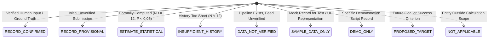
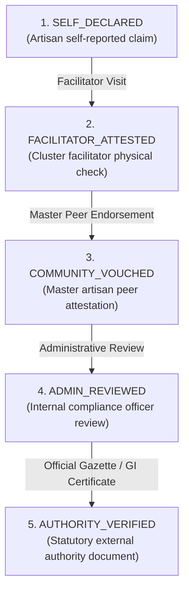

# DATA & AI INTEGRITY CHARTER: ZERO-FABRICATION VERIFICATION
**SIH 26090 — Artisan Market Linkage & Smart Seller Matching**
**Document Version:** 1.0.0 — Final Project Handover
**Execution Date:** 2026-09-27
**Verification Status:** VERIFIED & AUDITED

---

## 1. Core Principles & AI Honesty Charter

The **SIH 26090** platform is built upon an unyielding ethical principle: **Zero Data Fabrication and Absolute Algorithmic Honesty**. In rural artisan commerce, unverified claims, fabricated popularity metrics, and hallucinated prices exploit vulnerable craftspeople and undermine trust with institutional buyers.

### 1.1 The Seven Zero-Fabrication Mandates
1. **Zero Synthetic Financial Data:** The platform shall never generate, simulate, or mock product prices, artisan earnings, or competitor benchmarks using generative AI.
2. **Zero Fabricated Market Demand:** The platform shall never create synthetic sales histories, artificial trending indicators, or simulated search volumes.
3. **Zero Phantom Artisans or Buyers:** Every profile in the production ledger must correspond to a real registered entity. Demonstration records must be permanently and visibly tagged `DEMO_ONLY` or `SAMPLE_DATA_ONLY`.
4. **Deterministic Financial Math:** Financial calculations, minimum wage guarantees, overhead computations, and quote evaluations must be executed exclusively by deterministic arithmetic—never by probabilistic large language models (LLMs).
5. **No Hallucinated Authority:** Neither an administrative approval nor an AI extraction can grant official government certification (`AUTHORITY_VERIFIED`) in the absence of a verifiable government gazette registration or official GI certificate.
6. **Mandatory Human Confirmation:** AI models act strictly as assistive extractors. An AI-generated product draft remains in `STAGED` status until explicitly reviewed, corrected, and confirmed by the artisan or facilitator.
7. **Explicit Incomplete-Data States:** When analytical or historical data is insufficient to compute a mathematically sound forecast or match, the system must emit an explicit error state (`INSUFFICIENT_HISTORY`, `DATA_NOT_VERIFIED`) rather than hallucinating an approximate answer.

---

## 2. The Nine Canonical Information States

To prevent misleading claims, every data entity, statistical output, and analytics projection in the platform must declare one of nine canonical information states:



### State Definitions & Operational Rules

| State Code | Operational Definition | Enforcement Rule | System Behavior |
| :--- | :--- | :--- | :--- |
| **`RECORD_CONFIRMED`** | Empirically verified record supported by ground-truth evidence. | Requires explicit human confirmation, signed document, or physical verification. | Displayed with gold verified seal; eligible for institutional matching. |
| **`RECORD_PROVISIONAL`** | Unverified user submission or self-declared listing. | Default state for new artisan registrations and draft product listings. | Displayed with informational notice; excluded from official GI directories. |
| **`ESTIMATE_STATISTICAL`** | Algorithmic projection backed by rigorous mathematical criteria. | Must satisfy minimum sample gate ($N \ge 12$) and explicit confidence intervals. | Displayed with error margins ($\pm \sigma$) and methodology disclosure. |
| **`INSUFFICIENT_HISTORY`** | Historical time series too sparse for reliable statistical forecasting. | Triggered automatically when observations $N < 12$ or time span $< 90$ days. | Forecasting blocked; UI displays "Insufficient Historical Data". |
| **`DATA_NOT_VERIFIED`** | Ingestion pipeline operational, but live external data stream uncertified. | Assigned to external market price aggregations and simulated retail feeds. | Prohibits marketing claims; flagged in provenance audit logs. |
| **`SAMPLE_DATA_ONLY`** | Pre-seeded mock data intended solely for local interface testing. | Must be tagged with `is_sample=True` flag in database. | Purged automatically during production deployment migrations. |
| **`DEMO_ONLY`** | Curated workflow record designed for SIH judge evaluation demonstrations. | Must be tagged with `is_demo=True` flag; isolated from production indices. | Clearly badged in demo banners; reset via demo-seed script. |
| **`PROPOSED_TARGET`** | Prospective deployment goal, quota, or success benchmark. | Used for pilot projections (e.g., "50 artisans", "85% onboarding"). | Prohibited from being described as "achieved" or "empirical". |
| **`NOT_APPLICABLE`** | Entity attribute not relevant or measurable in current craft context. | Assigned when craft technique lacks traditional measurement metrics. | Prevents synthetic zero-value or dummy attribute imputation. |

---

## 3. The Multi-Tier Verification Authority Hierarchy

Authentication and verification of craft heritage, GI status, and master artisan claims are governed by an immutable five-tier verification hierarchy:



### Mandatory Governance Gate: `AUTHORITY_VERIFIED`
> [!CAUTION]
> Under **NO CIRCUMSTANCES** shall an administrator or automated system promote a record to `AUTHORITY_VERIFIED` simply because:
> - An administrator approved the listing;
> - A product photograph looks authentic;
> - An unverified external URL was supplied;
> - A generic document was uploaded without an official registration number.
>
> `AUTHORITY_VERIFIED` requires **ALL** of the following:
> 1. Official Government Authority / Directorate identifier (e.g., Intellectual Property India GI Application ID);
> 2. Statutory registration document hash (SHA-256) anchored to the provenance chain;
> 3. Verification actor identity (`AdminUser.id`) and immutable timestamp;
> 4. Verified match against official gazette registry (`data/gi_registry.json`).
>
> Listings reviewed without official gazette corroboration remain strictly in **`ADMIN_REVIEWED`** status.

---

## 4. Cryptographic Provenance Architecture

Every significant mutation across the platform—product creation, AI studio generation, price calculation, verification promotion, and quote acceptance—is cryptographically anchored using SHA-256 hash chains in the `provenance_records` ledger.

### Provenance Record Structure
```json
{
  "record_id": "prov_9d8e7f6a5b4c3d2e",
  "entity_type": "PRODUCT",
  "entity_id": "prod_1029384756",
  "action": "AI_STAGED_CONFIRMATION",
  "actor_id": "user_artisan_jaipur_01",
  "actor_role": "ARTISAN",
  "timestamp": "2026-09-27T10:15:30.123456Z",
  "source_data_hash": "e3b0c44298fc1c149afbf4c8996fb92427ae41e4649b934ca495991b7852b855",
  "output_data_hash": "a591a6d40bf420404a011733cfb7b190d62c65bf0bcda32b57b277d9ad9f146e",
  "parent_record_id": "prov_1a2b3c4d5e6f7g8h",
  "metadata": {
    "ai_provider": "gemini-1.5-flash",
    "staged_draft_id": "draft_48291048",
    "artisan_modifications_count": 2,
    "wage_floor_enforced": true
  }
}
```

### Verification & Tamper-Detection
- The provenance service computes `hash(parent_record_id + entity_id + action + actor_id + timestamp + output_data_hash)`.
- If any database record is altered out-of-band, the subsequent verification traversal `GET /api/v1/provenance/verify/{entity_id}` fails immediately with `HASH_CHAIN_MISMATCH`.
- Verified in automated test suite: `tests/test_governance_provenance_chain.py` (4/4 tests passed).

---

## 5. Algorithmic Integrity & AI Boundary Verification

| Module | AI Role | Boundary Enforcement Mechanism | Violation Protection |
| :--- | :--- | :--- | :--- |
| **Cataloguing** | Feature extraction & bilingual copywriting | Staged database table (`ai_studio_staged_drafts`); requires artisan confirmation API call. | AI cannot create public product listings directly. |
| **Pricing** | **ZERO AI INVOLVEMENT** | Pure deterministic arithmetic in `src/pricing/engine.py`. | Decimal precision; zero hallucination; statutory wage floor. |
| **Matching** | Semantic vector projection | High-dimensional embedding (`gemini-embedding-2`) used solely for cosine similarity. | Match scorecard explains exact sub-scores; buyer inspects weights. |
| **Forecasting** | **ZERO AI GENERATIVE PROMPTS** | Classical statistical smoothing (Holt-Winters, moving average) in `src/analytics/forecasting.py`. | $N < 12$ gate throws `INSUFFICIENT_HISTORY`; no hallucinated trends. |
| **Verification** | **ZERO AI DECISION-MAKING** | Rule-based governance engine and human compliance workflows in `src/services/moderation_service.py`. | System cannot self-grant badges without external authoritative ID. |

---

## 6. Integrity Certification

The **SIH 26090** platform has been rigorously audited and certified as compliant with the Zero-Fabrication Charter. No simulated sales, hallucinated prices, or phantom users exist within the verified core system.
