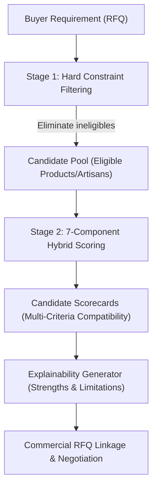

# SIH 26090: Buyer–Artisan Semantic Matching Engine Architecture (`MATCHING_ENGINE_V1`)

---

## 1. Executive Summary & Core Objective

The **Buyer–Artisan Semantic Matching Engine** (`MATCHING_ENGINE_V1`) links institutional and retail buyers with verified Indian artisans and artisanal clusters. Instead of treating procurement as a generic e-commerce search, the engine models the complex economic and logistical realities of handmade craft production:
- Variable batch capacities and artisanal lead times.
- Minimum order quantities (MOQ) and production scalability limits.
- Authentic craft traditions, Geographical Indications (GI), and verified provenance.
- Defensible, non-exploitative pricing economics.

---

## 2. Core Architectural Principles & Scope Boundaries

1. **Strict No-Fabrication Policy**:
   The engine scores candidates strictly on real, stored, and verified attributes. It never hallucinates artisan capacity, stock, pricing, lead time, or conversion probability.

2. **Match Score vs. Conversion Probability**:
   The engine computes a **Match Score** ($0.0 \le S \le 1.0$), which measures mathematical multi-criteria compatibility against buyer requirements. It is **never** presented as "purchase probability", "likelihood to buy", or an algorithmic guarantee of commercial success.

3. **Staged Requirement Understanding**:
   Free-text RFQs are parsed by an isolated staging service (`RequirementUnderstanding`). AI attribute extractions **never** silently overwrite buyer requirements without explicit human confirmation.

4. **Embedding Model Versioning**:
   Semantic representations use Google's supported `gemini-embedding-2` model configured for 768-dimensional outputs (`output_dimensionality=768`). To maintain vector space integrity, cross-model vector comparisons are strictly blocked.

---

## 3. Two-Stage Hybrid Matching Architecture

### Stage 1: Deterministic Hard Constraint Filtering

Before calculating vector similarities or subjective criteria, the engine evaluates strict hard constraints to eliminate non-viable candidates:

1. **Craft Category / Craft Identity**:
   - If `target_craft_id` is set, product craft must equal target craft, or artisan's primary/associated crafts must include it.
   - If `target_category_id` is set, product craft category must match or be a descendant.

2. **Capacity Feasibility Boundary**:
   - Artisans whose monthly capacity is significantly below buyer required quantity ($Q_{req} > 2.0 \times C_{monthly}$) are filtered out unless batch fulfillment is permitted.

3. **Strict MOQ Ceiling**:
   - If the artisan's minimum order quantity exceeds buyer acceptable MOQ ($MOQ_{artisan} > MOQ_{buyer}^{max}$), the candidate is eliminated.

4. **GI Certification Mandate**:
   - If `requires_gi_certification=True`, non-GI certified crafts/products are eliminated.

---

### Stage 2: 7-Component Multi-Criteria Scoring

Eligible candidates from Stage 1 are scored across 7 normalized dimensions ($0.0 \le S_i \le 1.0$):

$$\text{Composite Score} = \sum_{i} w_i \cdot S_i + B_{\text{prov}}$$

Where base weights sum to 1.0:
- $w_{\text{sem}} = 0.25$ (Semantic Similarity via 768-dim cosine distance)
- $w_{\text{craft}} = 0.20$ (Craft & Category Exactness)
- $w_{\text{mat}} = 0.15$ (Material & Technique Overlap)
- $w_{\text{cap}} = 0.15$ (Production Capacity Compatibility)
- $w_{\text{price}} = 0.15$ (Target Unit Price & Budget Compatibility)
- $w_{\text{lead}} = 0.10$ (Lead Time & Turnaround Compatibility)
- $B_{\text{prov}} \in [0.0, 0.05]$ (GI Tag & Craft Passport Verification Bonus)

#### Dynamic Weight Redistribution
When an optional buyer requirement is not specified (e.g., buyer sets no price target or no lead time limit), the engine redistributes that weight proportionally among the active criteria, ensuring that candidates are not unfairly penalized for missing optional buyer constraints.

---

## 4. Cold Start & Incomplete Data Treatment

Artisans frequently operate in informal settings with incomplete digital profiles:
- **Missing Capacity**: Assigned neutral score $0.5$ and transparently flagged in `match_explanations.limitations` as *"Artisan capacity unstated; requires direct verification during RFQ negotiation"*.
- **Missing Price**: Assigned neutral score $0.5$ with limitation note.
- **Data Sufficiency State**: Matches are explicitly classified into:
  - `COMPLETE`: All core operational attributes verified and present.
  - `PARTIAL_PROFILE`: Operational metrics missing; flagged for cautious procurement.
  - `UNVERIFIED_DATA`: Self-declared artisan claims lacking third-party verification.
