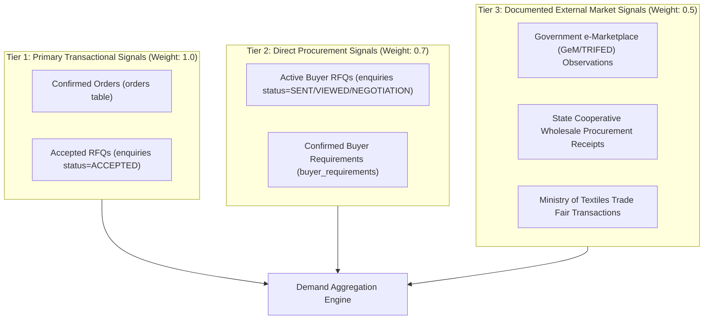
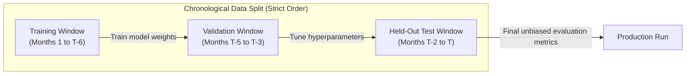

# SIH 26090: Phase 7 — Demand Intelligence & Real Analytics Architecture Plan

**Document**: `docs/phase_7_demand_intelligence_plan.md`  
**Milestone**: Phase 7 — Workstream A: Demand Intelligence & Real Analytics  
**Version**: 1.0.0-PLANNING  
**Status**: PLANNING ONLY — PENDING USER APPROVAL  

---

## 1. Executive Summary & Repository Assessment

The **Demand Intelligence & Real Analytics** subsystem provides authentic, transparent, and evidence-grounded visibility into market interest for traditional Indian crafts. Traditional craft sectors suffer from volatile, seasonal, and opaque buyer interest, making it difficult for rural artisans and cooperatives to plan raw material procurement and production runs.

### 1.1 Assessment of Current Repository State
- **Existing Models**:
  - `DemandObservation` ([`backend/app/models/market.py`](file:///E:/backend/app/models/market.py#L82-L99)): Registered in SQLAlchemy metadata with `craft_id`, `geography_state`, `observation_period_start`, `observation_period_end`, `total_enquiries`, `fulfilled_orders`, `average_realized_price`, `seasonal_festival_tag`, and `data_source_id`. Inherits `ProvenanceMixin`.
  - `DemandForecast` ([`backend/app/models/market.py`](file:///E:/backend/app/models/market.py#L102-L123)): Contains `craft_id`, `forecast_period_month`, `forecast_period_year`, `projected_demand_index`, `confidence_score`, `data_sufficiency_status`, and `explanation_note`.
- **Existing Services & Endpoints**:
  - Currently **zero** services, endpoints, or pipelines exist for demand ingestion, aggregation, trend calculation, or forecasting.
- **Transactional Ground Truth**:
  - The platform now contains verified Phase 1–6 models with real potential transactional demand signals:
    - `BuyerRequirement` (procurement briefs with quantity, budget, deadline, target craft/category, state).
    - `Match` (candidates evaluated and proposed).
    - `Enquiry` (formal RFQs with proposed quantities and unit prices).
    - `Order` (confirmed transactions with fulfillment statuses).

---

## 2. Absolute No-Fabrication Policy & AI Honesty Charter

In strict accordance with the SIH 26090 Data Strategy and AI Honesty Charter:
1. **Zero Synthetic Demand**: The platform must **never** manufacture fake historical enquiry volumes, simulated order numbers, artificial buyer search curves, or synthetic revenue.
2. **Explicit Insufficient Data States**: When historical observations for a craft/region are absent or below statistical thresholds, the engine must return explicit, unambiguous status codes:
   - `INSUFFICIENT_DATA`: Fewer than 3 historical periods for trend calculation.
   - `NO_DEMAND_OBSERVATIONS`: Zero recorded signals for the requested craft/region/period.
   - `INSUFFICIENT_HISTORY`: Fewer than 12 consecutive historical monthly periods for time-series forecasting.
   - `FORECAST_UNAVAILABLE`: Cannot reliably project without violating statistical integrity.
3. **No Fabricated Confidence Percentages**: The system will never display an arbitrary "94% Accuracy" or "High Selling Probability" without an empirical, held-out evaluation dataset.
4. **Neutral Terminology**: Terminology must be descriptive and non-speculative:
   - Approved: *"Observed Demand"*, *"Recorded RFQ Volume"*, *"Empirical Trend"*, *"Projected Index"*.
   - Prohibited: *"Guaranteed Demand"*, *"Hot Trending Product"*, *"Guaranteed Quick Sale"*, *"High Opportunity Score"*.

---

## 3. Demand Signal Taxonomy

To prevent subjective metrics (e.g., website clicks or impressions) from distorting commercial production planning, demand is categorized into three strict tiers:



### Signal Specifications

| Signal Category | Data Source / Table | Quantifiable Metrics | Validity & Verification Requirements |
|---|---|---|---|
| **ORDER_FULFILLMENT** | `orders` | `total_amount_inr`, quantity, unit price | Confirmed order linkage with non-cancelled status. |
| **COMMERCIAL_RFQ** | `enquiries` | `proposed_quantity`, `proposed_unit_price` | Verified buyer profile, active RFQ reference number. |
| **BUYER_REQUIREMENT** | `buyer_requirements` | `required_quantity`, `max_budget_inr` | Human-confirmed requirement brief with target craft/category. |
| **EXTERNAL_MARKET_RECORD** | `demand_observations` | `total_enquiries`, `fulfilled_orders`, `average_realized_price` | Sourced from verified public registries or institutional reports with `data_source_id`. |

*Note on Web Telemetry*: Page views, product impressions, and catalogue bookmarks are classified as **User Interaction Telemetry** and are **excluded** from commercial demand aggregation.

---

## 4. Evaluation of Existing Database Models

### 4.1 `DemandObservation` Assessment & Extension
The existing `DemandObservation` table is well-indexed on `(craft_id, observation_period_start)` and `geography_state`, but requires architectural extensions to support granular multi-dimensional analysis:

1. **Add `craft_category_id` (ForeignKey to `craft_categories.id`)**: Enables roll-up demand analysis for parent categories (e.g., "Handloom Textiles") even when specific craft tags are unstated.
2. **Add `signal_tier`**: Enum (`TRANSACTIONAL_CONFIRMED`, `PROCUREMENT_INTENT`, `EXTERNAL_BENCHMARK`).
3. **Add `observation_type`**: String (`PLATFORM_NATIVE`, `GOVERNMENT_REGISTRY`, `COOPERATIVE_SALE`, `TRADE_FAIR`).
4. **Add `unit_volume`**: Integer representing actual physical units demanded (distinct from enquiry count).
5. **Add `monetary_volume_inr`**: Numeric(14, 2) representing gross commercial demand value.
6. **Add `ingestion_batch_id`**: For idempotent external imports and batch rollbacks.

### 4.2 `DemandForecast` Assessment: Replace with Run-Point Structure
The current `DemandForecast` model stores only a single forecast point per row without tracking model runs, parameter versions, training windows, or evaluation metrics.  
**Decision**: Retain `DemandForecast` as a historical record table, but introduce an immutable **Run-Point Architecture**:
- **`DemandForecastRun`**: Records each execution of the forecasting pipeline, including model identity, version, training date range, observations evaluated, algorithm configuration, and validation error metrics.
- **`DemandForecastPoint`**: Individual forecast points generated by a run (e.g., month +1, month +2, month +3) with projected index, uncertainty intervals, and explicit sufficiency statuses.

---

## 5. Real Data Ingestion & Provenance Architecture

### 5.1 Ingestion Pipeline Architecture
External demand observations are processed using the Phase 1 ingestion framework (`scripts/ingestion/`):
1. **Audit Receipt Creation**: Generate entry in `data_imports` linked to a registered `DataSource`.
2. **Strict Schema & State Validation**: Validate geography (valid Indian States/UTs), craft ID reference, positive quantities, and chronological dates (`observation_period_start <= observation_period_end`).
3. **Deduplication Strategy**: Composite uniqueness check on `(craft_id, geography_state, observation_period_start, observation_period_end, data_source_id)`.
4. **Sample Data Segregation**: Any non-official demo dataset is tagged with `is_sample_or_demo=True` and permanently excluded from canonical platform aggregations.

---

## 6. Deterministic Demand Aggregation Service

Aggregation runs deterministically without heuristic smoothing or non-reproducible approximations.

### 6.1 Aggregation Dimensions & Periods
- **Dimensions**:
  - By Craft (`craft_id`)
  - By Category (`craft_category_id` including hierarchical recursive roll-ups)
  - By Region (`geography_state`)
  - Platform-wide
- **Temporal Buckets**:
  - `MONTHLY` (Primary institutional planning cadence)
  - `QUARTERLY` (Seasonal festival cycle analysis)
  - `WEEKLY` (Short-term operational procurement monitoring)

### 6.2 Edge-Case Handling Rules
1. **Timezone Normalization**: All timestamps converted to Indian Standard Time (`UTC+05:30` / `Asia/Kolkata`) prior to calendar bucket assignment.
2. **Missing Dates vs. Zero Demand**:
   - A period with no recorded transactions is recorded as **`NO_OBSERVATIONS`**, NOT zero demand.
   - It is only classified as zero demand if an external source explicitly reports zero sales during active operating hours.
3. **Partial & In-Progress Periods**: The current unclosed calendar month is explicitly tagged as `IS_PARTIAL_PERIOD=True` and is excluded from historical trend baseline comparisons.
4. **Late-Arriving Observations**: Platform transactions occurring retroactively update historical bucket caches through deterministic recalculation.

---

## 7. Demand Trend Analysis Methodology

The Trend Service evaluates change across comparable historical periods:

### 7.1 Trend Indicators & Formulas
- **Absolute Change**: $\Delta D = D_{\text{current}} - D_{\text{previous}}$
- **Percentage Change**:
  $$\% \Delta D = \begin{cases} \frac{D_{\text{current}} - D_{\text{previous}}}{D_{\text{previous}}} \times 100 & \text{if } D_{\text{previous}} > 0 \\ \text{UNDEFINED} & \text{if } D_{\text{previous}} = 0 \end{cases}$$
- **Rolling Averages**: 3-period and 6-period moving averages ($\text{SMA}_3, \text{SMA}_6$).

### 7.2 Discrete Trend States
The system assigns one of four deterministic states:
1. `INCREASING`: $\% \Delta D \ge +5.0\%$ with at least 3 consecutive periods of observation.
2. `DECREASING`: $\% \Delta D \le -5.0\%$ with at least 3 consecutive periods of observation.
3. `STABLE`: $-5.0\% < \% \Delta D < +5.0\%$.
4. `INSUFFICIENT_DATA`: Fewer than 3 historical periods available.

---

## 8. Forecasting Architecture & AI Honesty Protocol

### 8.1 Model Selection & Minimum Data Requirements

| Forecasting Algorithm | Minimum Data Threshold ($N$) | Recommended Horizon | Suitable Domain |
|---|---|---|---|
| **Deterministic Naive Baseline** | $N \ge 3$ consecutive months | 1 month | Very young craft categories with minimal transaction history. |
| **Weighted Moving Average (WMA)** | $N \ge 6$ consecutive months | 1–2 months | Stable, non-seasonal artisanal crafts. |
| **Holt-Winters Exponential Smoothing** | $N \ge 24$ consecutive months (2 full annual cycles) | 3 months | Highly seasonal festival crafts (e.g., Durga Puja idols, Diwali brass lamps). |
| **ARIMA / SARIMAX** | $N \ge 36$ consecutive months | 3–6 months | Mature clusters with multi-year government census baselines. |

### 8.2 Strict Eligibility Gatekeeper
Before invoking any forecast algorithm:
```python
if historical_periods_count < 12:
    return DemandForecastResult(
        status="INSUFFICIENT_HISTORY",
        projected_index=None,
        explanation="At least 12 months of authentic observation history are required for statistical projection."
    )
```

---

## 9. Leakage Prevention & Temporal Validation Strategy

To guarantee that forecasting models never cheat or present artificially inflated accuracy:



### 9.1 Leakage Prevention Rules
1. **Zero Random Splitting**: Cross-validation using random shuffling is strictly prohibited. Only **Rolling-Origin Temporal Evaluation** (Walk-Forward Validation) is permitted.
2. **Feature Construction Isolation**: Rolling averages and lag features must only use observations strictly preceding the forecast horizon point ($t < T_{\text{cutoff}}$).
3. **No Test Set Tuning**: Model parameters (e.g., smoothing parameters $\alpha, \beta, \gamma$) are optimized on the validation window; the test window is evaluated once for final reporting.

---

## 10. Demand Intelligence REST APIs

All endpoints enforce role-based access control and strict PII redaction:

| Endpoint | Method | Role | Description |
|---|---|---|---|
| `/api/v1/demand/observations` | `GET` | `artisan`, `buyer`, `admin` | Filtered list of historical demand observations (by craft, category, state, period). |
| `/api/v1/demand/summary` | `GET` | `artisan`, `buyer`, `admin` | Aggregated demand volumes, enquiry counts, and order statistics for a craft/region. |
| `/api/v1/demand/trends` | `GET` | `artisan`, `buyer`, `admin` | Directional trend analysis (INCREASING, DECREASING, STABLE, INSUFFICIENT_DATA). |
| `/api/v1/demand/forecasts` | `GET` | `artisan`, `buyer`, `admin` | Latest projected demand index with explicit data sufficiency status and limitations. |
| `/api/v1/demand/forecasts/runs` | `GET` | `admin` | Audit log of forecast pipeline executions with validation error metrics. |
| `/api/v1/demand/ingest` | `POST` | `admin` | Admin ingestion endpoint for official external demand datasets with provenance. |

---

## 11. User Interface Specifications

### 11.1 Artisan-Facing Demand Insights (`/artisan/demand`)
- **Craft Interest Snapshot**: Shows verified monthly RFQ and enquiry counts for the artisan's primary and associated crafts.
- **Seasonal Cycle Indicators**: Displays known cultural peak periods (e.g., "Wedding Season: Oct–Feb", "Diwali: Oct–Nov") based on official festival calendars.
- **Honest Limitation Callouts**: When data is sparse, renders an amber banner:  
  *“Limited historical data recorded for this craft. Projections will become available as more institutional RFQs are recorded.”*
- **Zero Ranking Guarantees**: Does not rank or compare individual artisans.

### 11.2 Admin Analytics Dashboard (`/admin/analytics/demand`)
- Visual segregation of **OBSERVED** (blue), **CALCULATED** (green), and **FORECAST** (purple) metrics.
- Data ingestion coverage breakdown by Indian State/UT.
- Pipeline execution health and backtest Mean Absolute Percentage Error (MAPE) logs.
