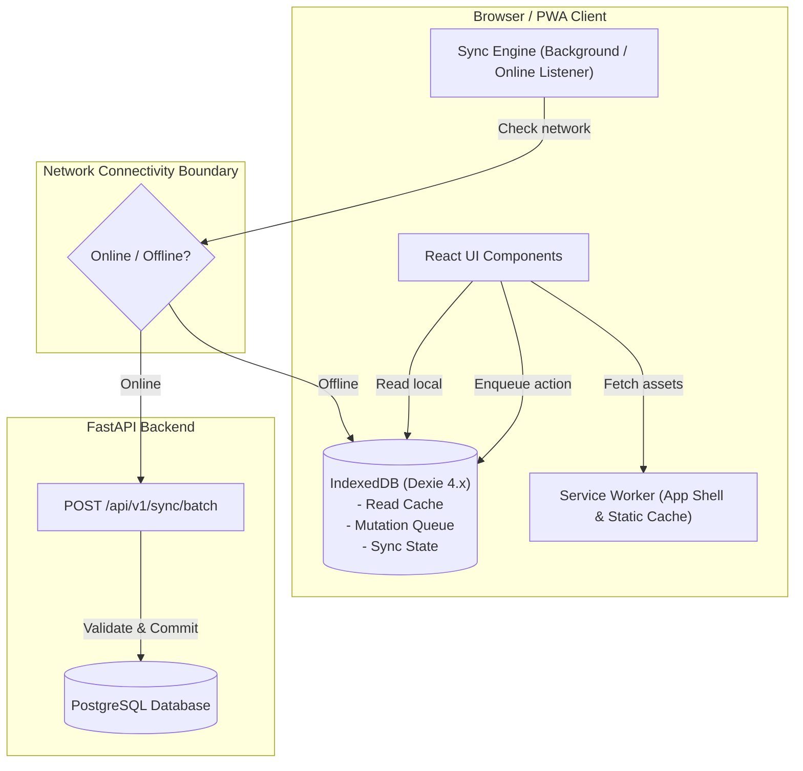
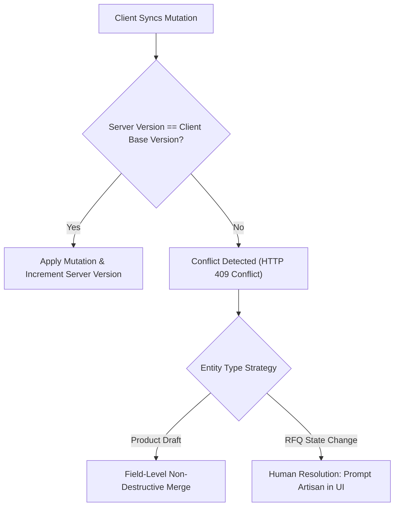

# SIH 26090: Phase 7 — Offline-First PWA Architecture Plan

**Document**: `docs/phase_7_offline_pwa_plan.md`  
**Milestone**: Phase 7 — Workstream B: Offline-First Progressive Web App (PWA)  
**Version**: 1.0.0-PLANNING  
**Status**: PLANNING ONLY — PENDING USER APPROVAL  

---

## 1. Executive Summary & Problem Context

Artisan clusters across India (such as Chanderi, Pochampally, Bastar, and Kutch) often operate in regions with intermittent, high-latency, or zero 2G/3G connectivity. Requiring continuous, real-time connectivity creates severe usability barriers, leading to lost product drafts, interrupted RFQ responses, and communication failures.

**Workstream B Objective**: Design an offline-resilient, Progressive Web App (PWA) experience that allows artisans to browse cached catalogue information, draft and edit products, compose RFQ replies, queue mutations safely in local IndexedDB storage, and automatically synchronize with the backend once connectivity is restored, with zero silent data loss and transparent conflict resolution.

---

## 2. Current Frontend Assessment & Technology Stack

### 2.1 Repository Assessment
- **Next.js Version**: Next.js 14.2.0 (App Router).
- **React Version**: React 18.3.0.
- **Client Storage Dependencies**: `dexie` (`^4.0.1`) is already installed in `package.json`. Dexie is a robust, type-safe IndexedDB wrapper.
- **Current PWA Status**:
  - `public/manifest.json`: **Not yet created**.
  - Service Worker (`sw.js`): **Not yet created**.
  - PWA icons / theme metadata: **Not yet configured**.
  - IndexedDB storage schema: **Not yet defined**.

---

## 3. PWA Architecture Overview



---

## 4. App Shell & Static Asset Caching Strategy

The Service Worker (`public/sw.js`) guarantees that the platform UI loads instantly even when completely offline:

### 4.1 Caching Strategies by Asset Class
1. **App Shell & Static Bundles** (`CacheFirst`):
   - Next.js compiled JavaScript chunks, CSS styles, web fonts, and static logos.
   - Cache name: `sih26090-static-v1`.
   - Invalidation: Cache bust via Next.js unique build hash (`_next/static/[buildHash]/...`).
2. **Master Directory Data** (`StaleWhileRevalidate`):
   - Craft directory (`/api/v1/crafts`), categories (`/api/v1/craft-categories`), Indian states/districts.
   - Cache name: `sih26090-data-v1`.
   - Max age: 7 days.
3. **Transactional & Private APIs** (`NetworkOnly` with IndexedDB Fallback):
   - Authentication tokens, profile updates, product creations, RFQ negotiations.
   - Never stored directly in generic browser HTTP cache. Handled exclusively through the **Offline Mutation Queue**.

---

## 5. Client Read Cache Architecture (Dexie / IndexedDB)

Authorized artisan and catalogue data is cached locally in IndexedDB using Dexie:

### 5.1 Local Dexie Tables

```typescript
// Proposed Dexie Schema: sih26090_offline_db
export interface CachedProduct {
  id: string;
  artisan_id: string;
  title: string;
  sku: string;
  price_inr: number;
  stock_quantity: number;
  status: string;
  craft_name?: string;
  thumbnail_data_url?: string;
  updated_at: string;
  is_local_draft: boolean;
}

export interface CachedRFQ {
  id: string;
  rfq_reference_number: string;
  buyer_id: string;
  buyer_company_name?: string;
  proposed_quantity: number;
  proposed_unit_price: number;
  status: string;
  message: string;
  updated_at: string;
}

export interface CachedCraft {
  id: string;
  name: string;
  state: string;
  gi_tag_number?: string;
  category_name?: string;
}
```

### 5.2 Read Authorization & Security Boundaries
- **User Scoping**: All cached tables include `user_id`. Queries strictly filter by the authenticated user's ID.
- **Cache Eviction on Logout**: Calling `/api/v1/auth/logout` triggers an atomic purge of the local IndexedDB database:
  ```typescript
  await db.delete(); // Drops database and deletes all cached artisan/RFQ rows
  ```
- **Zero Sensitive PII in Offline Cache**: Government identification documents, Aadhaar/Pehchan KYC files, and buyer financial account details are **never** written to IndexedDB.

---

## 6. Offline Mutation Queue Architecture

When an artisan creates a product draft, updates inventory, or composes an RFQ response without connectivity, the action is enqueued locally.

### 6.1 Mutation Queue Schema (`offline_mutations`)

| Field | Type | Description |
|---|---|---|
| `local_id` | `string` (UUID) | Client-generated unique mutation identifier. |
| `idempotency_key` | `string` (UUID) | Cryptographic key sent to the backend to prevent duplicate execution upon retry. |
| `user_id` | `string` | ID of the authenticated user performing the action. |
| `entity_type` | `string` | Target entity: `PRODUCT`, `PRODUCT_MEDIA`, `RFQ_RESPONSE`. |
| `entity_id` | `string` | Server ID if modifying existing record, or temporary client UUID if creating. |
| `operation_type` | `string` | `CREATE`, `UPDATE`, `DELETE`, `RESPOND_RFQ`. |
| `payload` | `JSON` | Complete serialized request body. |
| `created_at` | `string` (ISO) | Client timestamp of action creation. |
| `status` | `string` | `PENDING`, `SYNCING`, `SYNCED`, `CONFLICT`, `REJECTED`. |
| `retry_count` | `number` | Counter for exponential backoff retries (max: 5). |
| `error_message` | `string` | Server error response if validation failed. |

---

## 7. Synchronization Engine & Idempotency Protocol

### 7.1 Sync Engine Lifecycle
1. **Connectivity Detection**: Listens to `window.addEventListener('online')` and `navigator.onLine`, supplemented with periodic HTTP `/api/v1/health/liveness` heartbeats.
2. **Sequential Batch Replay**:
   - Mutations are processed in strict chronological order per entity (`created_at ASC`).
   - Dispatches batch payload to new endpoint: `POST /api/v1/sync/batch`.
3. **Idempotency Enforcement**:
   - Backend tracks `idempotency_key` in a dedicated server table: `sync_operations`.
   - If an operation with the same key was already successfully processed (e.g., during network drop right after server commit), the backend returns the cached success response without re-executing.
4. **Exponential Backoff**:
   - On server 5xx errors or network timeout, the sync engine retries at intervals: $2s, 4s, 8s, 16s, 32s$.
   - On 4xx client validation errors, the mutation is immediately marked `REJECTED` and flagged for artisan review.

---

## 8. Conflict Detection & Resolution Strategy

When multiple mutations occur or server data changed while the client was offline:



### 8.1 Conflict Policies by Domain
1. **Product Listings & Edits**:
   - Server checks `product.updated_at`.
   - If modified by another session: Server returns `409 Conflict` with latest server snapshot.
   - Client prompts artisan: *"Product was modified from another device. Keep your local changes or load server version?"*
   - Zero silent overwriting.
2. **RFQ Negotiations**:
   - If RFQ was already `ACCEPTED`, `DECLINED`, or `CANCELLED` on the server before client reconnects:
   - Queued response is marked `CONFLICT_STALE_STATE`.
   - Client displays modal: *"This RFQ has already been concluded by the buyer."*

---

## 9. Offline User Experience (UX) & Visual Indicators

Artisans must always know the exact synchronization state of their work:

### 9.1 Connection & Sync State Banner
- **Online (Synced)**: Subtle green badge: `● Online (All changes saved)`.
- **Offline**: Amber sticky pill: `○ Offline Mode (Work is saved locally and will sync automatically)`.
- **Syncing in Progress**: Blue spinner: `⟳ Syncing 3 pending items...`.
- **Sync Conflict Detected**: Red alert icon: `⚠ 1 item needs your review`.

### 9.2 Record-Level State Tags
- Products or RFQ messages stored only in local IndexedDB are rendered with an explicit badge:  
  `[LOCAL DRAFT - NOT YET SYNCED TO SERVER]`.
- Once confirmed by the server, the badge updates to:  
  `[SYNCED]`.

---

## 10. Web App Manifest & Installability

To enable home-screen installation on Android/iOS/desktop without app-store intermediaries:

### 10.1 Web App Manifest (`public/manifest.json`)
```json
{
  "name": "SIH 26090: Artisan Market Linkage",
  "short_name": "CraftLink",
  "description": "Smart Artisan Market Linkage and Seller Matching Platform",
  "start_url": "/artisan/products",
  "display": "standalone",
  "background_color": "#FFFBEB",
  "theme_color": "#D97706",
  "orientation": "portrait-primary",
  "icons": [
    {
      "src": "/icons/icon-192x192.png",
      "sizes": "192x192",
      "type": "image/png"
    },
    {
      "src": "/icons/icon-512x512.png",
      "sizes": "512x512",
      "type": "image/png"
    }
  ]
}
```

---

## 11. Backend Database Additions for Sync Tracking

To support safe replay and idempotency on the server side:

### 11.1 New Entity: `SyncOperation` (`sync_operations`)
- `id`: UUID (Primary Key).
- `idempotency_key`: `String(64)` (Unique, Indexed).
- `user_id`: `String(36)` (ForeignKey to `users.id`).
- `entity_type`: `String(30)`.
- `entity_id`: `String(36)`.
- `operation_type`: `String(30)`.
- `status`: `String(20)` (`COMMITTED`, `REJECTED`, `CONFLICT`).
- `response_payload`: `JSON` (Cached response returned upon duplicate replay).
- `created_at`: `DateTime(timezone=True)`.
