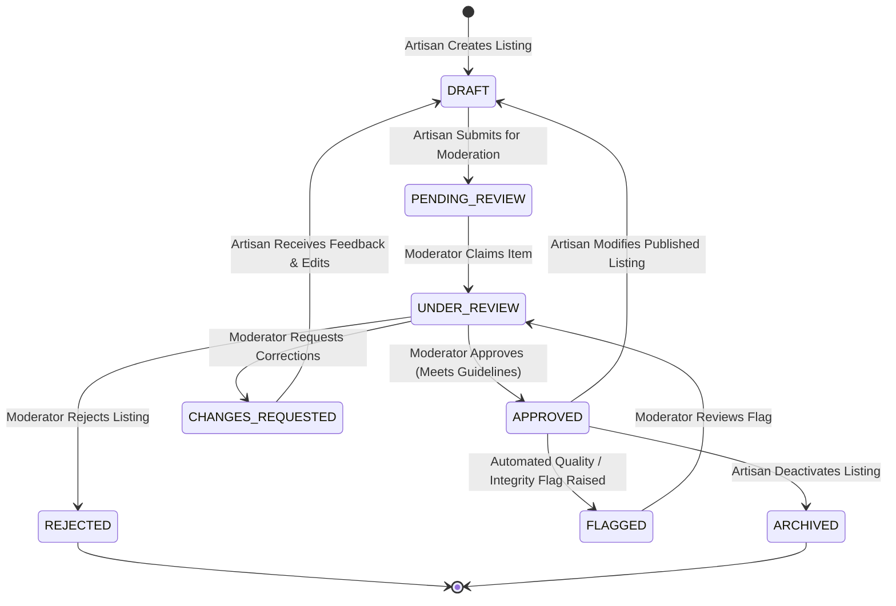
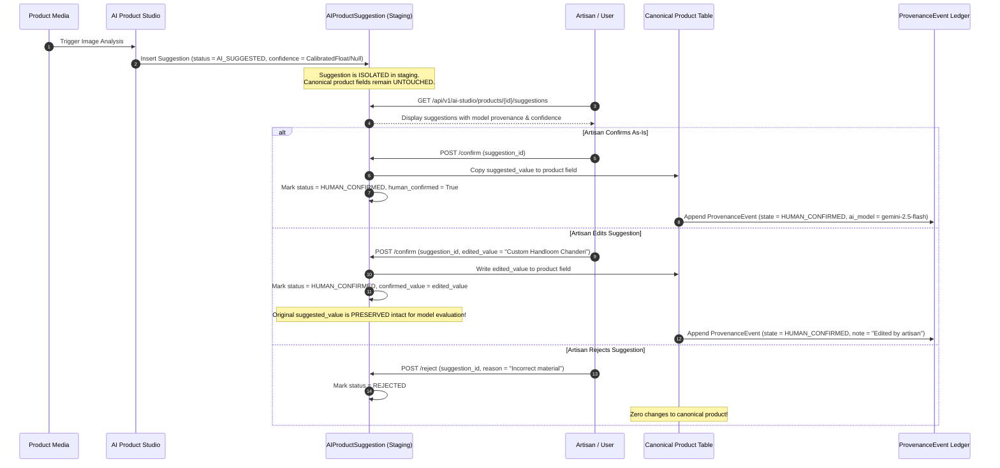

# SIH 26090: Phase 8 — Admin Moderation, Governance & Provenance Auditing Plan
## Production-Grade Governance, Multi-Tier Provenance, Tamper-Evident Auditing & Moderation Architecture

**Project**: SIH 26090 – Artisan Market Linkage & Smart Seller Matching  
**Phase**: PHASE 8 — Admin Moderation, Governance & Provenance Auditing  
**Status**: ARCHITECTURAL PLANNING SPECIFICATION  
**Author**: Antigravity DeepMind Advanced Agentic Coding Team  
**Date**: 2026-09-27  

---

## 1. Current Architecture Findings & Repository Inspection

An exhaustive inspection of the actual repository across all 34 declarative SQLAlchemy models, REST endpoints, and frontend components reveals the following foundational baselines:

1. **Information State Segregation Baselines**:
   - `ProvenanceMixin` (`backend/app/models/base.py`) establishes `is_sample_or_demo`, `data_provenance_level`, and `provenance_metadata` on all primary entities (`crafts`, `craft_passports`, `artisan_profiles`, `products`, `buyer_profiles`, `demand_observations`).
   - `ai_product_suggestions` and `requirement_understandings` provide isolated staging tables where AI extractions are held separate from canonical domain entities until human confirmation.
   - `price_analyses` and `matches` implement deterministic calculations (`CALCULATED`) with input snapshots and mathematical justifications.

2. **Audit Logging Baselines**:
   - `AuditLog` (`backend/app/models/auth.py`) records `actor_user_id`, `action`, `entity_type`, `entity_id`, `ip_address`, `user_agent`, `payload_before_json`, and `payload_after_json`.
   - `record_audit_event()` (`backend/app/services/audit_service.py`) appends records across sensitive operations (auth, product creation, updates, RFQs, verifications, sync).

3. **Current Moderation Endpoints**:
   - Product moderation exists in rudimentary form in `backend/app/api/v1/endpoints/products.py`: `POST /api/v1/products/{id}/submit`, `GET /api/v1/products/admin/pending`, `POST /api/v1/products/admin/{id}/review`.
   - Verification review exists in `backend/app/api/v1/endpoints/verifications.py`: `POST /api/v1/verifications/submit`, `GET /api/v1/verifications/admin/pending`, `POST /api/v1/verifications/admin/{id}/review`.

4. **Critical Gaps & Architectural Vulnerabilities Diagnosed**:
   - **Conflation of Admin Approval with Government Verification**: In `verifications.py:181`, when an administrator approved an artisan's document, the system automatically set `artisan.verification_status = "GOVERNMENT_VERIFIED_GI"`, and promoted passports to `verification_level = "GOVERNMENT_VERIFIED_GI"`. In `products.py:952`, when an administrator approved a product whose craft had a GI tag, `product.provenance_status` was automatically set to `"GOVERNMENT_GI_CONFIRMED"` without verifying if the artisan had an authorized user registration. This violates the zero-fabrication integrity principle.
   - **Lack of Field-Level Provenance History**: `AuditLog` captures coarse action payloads (`PRODUCT_UPDATED`), but cannot reconstruct a field-by-field chronological evolution of mutable attributes (`title`, `price_inr`, `materials`, `dimensions`) answering who changed what, when, why, from what source, and under which provenance state.
   - **Absence of Unified Moderation Workflow Entity**: Moderation decisions currently mutate status fields on the target model directly without a unified, queryable `ModerationAction` record tracking reviewer identity, transition reasons, internal notes, review duration, and appeals.
   - **Lack of Suspicious / Low-Quality Record Detection**: There is no systematic mechanism to raise neutral review signals (`GovernanceFlag`) for missing provenance, conflicting data, expired credentials, or accidental sample data exposure.
   - **Incomplete Role Hierarchy**: The platform recognizes `artisan`, `buyer`, and `admin`, but lacks dedicated distinction between `moderator` (operational content reviews) and `super_admin` (system policy, role management, audit chain inspections).

---

## 2. Existing Reusable Components vs. New Extensions

### A. Reusable Components (Zero Redundancy)
- `ProvenanceMixin`: Continue using `is_sample_or_demo` and `data_provenance_level` on all domain entities.
- `DataSource` and `DataImport`: Master external registry lineage tracking (`backend/app/models/provenance.py`).
- `AuditLog`: High-level security audit trail for user actions, logins, and API mutations.
- `Notification`: In-app notification dispatcher (`backend/app/models/auth.py`).
- `require_roles()` & `check_object_ownership()`: Role and IDOR authorization guards (`backend/app/core/permissions.py`).
- `AIProductSuggestion` & `RequirementUnderstanding`: Staging layers for AI proposals.

### B. Extended / Corrected Components
- `Verification` and `CraftPassport`: Decouple `ADMIN_APPROVED` from `AUTHORITY_VERIFIED`. Add explicit verification authority identifiers.
- `Product`: Eliminate automatic promotion to `GOVERNMENT_GI_CONFIRMED` upon admin approval. Enforce that GI confirmation requires an active, authority-verified `CraftPassport`.
- `require_roles()`: Support granular role hierarchies: `super_admin`, `admin`, `moderator`, `artisan`, `buyer`.

### C. New Governance Models
- `GovernanceFlag`: Automated and manual review signals for data quality, missing provenance, and policy violations.
- `ModerationAction`: Formal lifecycle tracking for all administrative reviews, approvals, rejections, and change requests.
- `ProvenanceEvent`: Append-only, tamper-evident field-level change history with cryptographic hash chaining.

### D. Components That Must NOT Be Changed
- Authentication and session management (`RefreshTokenSession`, `OTPChallenge`).
- Pricing engine mathematical algorithms (`FAIR_PRICE_ENGINE_V1`).
- Semantic vector matching logic (`MATCHING_ENGINE_V1`).
- Demand forecasting algorithms (`DEMAND_ENGINE_V1`).
- Existing Alembic migrations `20260326_0001` through `20260327_0007`.

---

## 3. Governance Data States & Information Integrity Matrix

To prevent misleading claims, the platform defines nine immutable information states. Under no circumstances may one state be silently converted to another.

| Information State | Definition | Permitted Actor | Requires External Proof? | Example |
| :--- | :--- | :--- | :--- | :--- |
| `ARTISAN_PROVIDED` | Direct input or declaration by the artisan. | Artisan | No | Self-declared craft history, story, dimensions. |
| `SOURCE_BACKED` | Sourced directly from documented external registry or feed. | System / Ingestion Pipeline | Yes (Source ID + URL) | GI registry record, census craft data, market index. |
| `AI_SUGGESTED` | Machine-generated proposal staged in an isolated review table. | AI Model Provider | Yes (Model metadata + prompt) | Multimodal attribute suggestion, brief extraction. |
| `CALCULATED` | Deterministic mathematical calculation derived from explicit inputs. | Engine / Service | Yes (Input snapshot + formula) | Unit production cost, fair price range, match score. |
| `HUMAN_CONFIRMED` | Explicit human review, edit, or approval of an advisory value. | Resource Owner (Artisan/Buyer) | Yes (User ID + timestamp) | Artisan accepting an AI-suggested product title. |
| `ADMIN_APPROVED` | Platform administrative compliance and quality policy clearance. | Moderator / Admin | Yes (Reviewer ID + reason) | Moderator approving product listing for public catalogue. |
| `ADMIN_REJECTED` | Platform rejection due to policy or quality failure. | Moderator / Admin | Yes (Reviewer ID + rejection reason) | Listing rejected due to non-craft commercial items. |
| `FLAGGED` | Marked for administrative investigation by automated check or user. | System / User | Yes (Flag type + trigger evidence) | Price anomaly, missing provenance, expired certificate. |
| `SUPERSEDED` | Historical record retired and replaced by a newer version. | System | Yes (Superseded by event ID) | Previous product price before an artisan price update. |

### Strict Non-Equivalence Axioms:
$$\text{AI\_SUGGESTED} \neq \text{HUMAN\_CONFIRMED}$$
$$\text{HUMAN\_CONFIRMED} \neq \text{AUTHORITY\_VERIFIED}$$
$$\text{ADMIN\_APPROVED} \neq \text{AUTHORITY\_VERIFIED}$$

An administrator's approval certifies only that the record satisfies platform guidelines and uploaded documentation appears valid; it **never** manufactures a statutory government claim without direct verification against official government registries.

---

## 4. Multi-Tier Verification Governance Model

To eliminate false government certification claims while recognizing authentic credentials, the platform establishes a 5-tier verification hierarchy:

```
Level 0: UNVERIFIED (Initial registration baseline)
   │
   ▼
Level 1: SELF_DECLARED (Artisan declares skills, experience, or cluster association)
   │
   ▼
Level 2: DOCUMENT_SUPPORTED (Credentials uploaded by artisan, awaiting review)
   │
   ▼
Level 3: ADMIN_REVIEWED (Platform moderator validated document legibility & consistency)
   │
   ▼
Level 4: AUTHORITY_VERIFIED (Matched directly against official CGPDTM/MoT government registry)
```

### Verification Criteria:
1. **`UNVERIFIED`**: Default state for any newly registered account or unreviewed profile.
2. **`SELF_DECLARED`**: Artisan claims membership or craft practice without supporting paperwork.
3. **`DOCUMENT_SUPPORTED`**: Artisan uploaded a Pehchan Card, Cooperative Certificate, or GI Authorized User document.
4. **`ADMIN_REVIEWED`**: A platform moderator inspected the document, verified the applicant's name matches government photo ID, verified expiry date, and approved the submission. The profile is marked `ADMIN_REVIEWED`.
5. **`AUTHORITY_VERIFIED`**: Applicable **only** when:
   - The document is verified against an active government registry record (`data_sources` table).
   - The GI Authorized User registration number is confirmed in the official CGPDTM GI database.
   - The certificate is unexpired and matches the artisan's legal identity.

---

## 5. Moderation Workflows & State Machines

### 5.1 Product Moderation Lifecycle
Products follow a strict deterministic state transition model:



### Transition Guard Rules:
- **`DRAFT` $\rightarrow$ `PENDING_REVIEW`**: Requires non-empty title, storytelling description ($\ge 10$ chars), valid price ($> 0$), stock quantity ($\ge 0$), and at least one uploaded media asset.
- **`APPROVED` $\rightarrow$ `DRAFT`**: Any modification to a published product's critical fields (`title`, `price_inr`, `materials`, `technique`, `craft_id`) automatically demotes status back to `DRAFT` to prevent post-approval bait-and-switch.
- **Moderator Assignment**: When a moderator opens a review, the listing transitions to `UNDER_REVIEW` with `locked_by_user_id` to prevent split-brain concurrent reviews.

### 5.2 Entity Moderation Matrix

| Entity | Supported States | Permitted Review Decisions |
| :--- | :--- | :--- |
| **Artisan Profile** | `PENDING_REVIEW`, `UNDER_REVIEW`, `APPROVED`, `CHANGES_REQUESTED`, `SUSPENDED` | `APPROVE_PROFILE`, `REQUEST_CHANGES`, `SUSPEND_PROFILE` |
| **Craft Association** | `ACTIVE`, `VERIFIED`, `FLAGGED`, `REJECTED` | `VERIFY_ASSOCIATION`, `FLAG_ASSOCIATION`, `DEACTIVATE` |
| **Product** | `DRAFT`, `PENDING_REVIEW`, `UNDER_REVIEW`, `APPROVED`, `CHANGES_REQUESTED`, `REJECTED`, `FLAGGED`, `ARCHIVED` | `APPROVE_PRODUCT`, `REQUEST_CHANGES`, `REJECT_PRODUCT` |
| **Product Media** | `PENDING_SCAN`, `APPROVED`, `FLAGGED`, `REJECTED` | `APPROVE_MEDIA`, `FLAG_MEDIA`, `DELETE_MEDIA` |
| **Craft Passport** | `DRAFT`, `SUBMITTED`, `UNDER_REVIEW`, `ADMIN_APPROVED`, `AUTHORITY_VERIFIED`, `REJECTED`, `EXPIRED` | `APPROVE_ADMIN_REVIEWED`, `CONFIRM_AUTHORITY_VERIFIED`, `REJECT_PASSPORT` |
| **Price Evidence** | `PROVISIONAL`, `SOURCE_VERIFIED`, `FLAGGED`, `REJECTED` | `VALIDATE_EVIDENCE`, `FLAG_OUTLIER`, `REJECT_EVIDENCE` |
| **Market Observation** | `PROVISIONAL`, `VALIDATED`, `FLAGGED_OUTLIER` | `VALIDATE_OBSERVATION`, `FLAG_OUTLIER`, `EXCLUDE` |

---

## 6. Tamper-Evident Provenance Audit Trail Architecture

### 6.1 Limitations of Legacy AuditLog
The legacy `AuditLog` captures macro API invocations (`PRODUCT_UPDATED`), but fails to capture:
1. Granular field-level changes (e.g., did price change from ₹1,200 to ₹1,800 or was title modified?).
2. Provenance state of each specific field update.
3. Cryptographic proof that audit records have not been altered or deleted by a rogue database operator.

### 6.2 Proposed `ProvenanceEvent` Entity
To achieve cryptographic auditability, a dedicated append-only `provenance_events` model is introduced:

```sql
CREATE TABLE provenance_events (
    id VARCHAR(36) PRIMARY KEY,
    entity_type VARCHAR(50) NOT NULL,
    entity_id VARCHAR(36) NOT NULL,
    field_name VARCHAR(100) NOT NULL,
    previous_value_json JSONB,
    new_value_json JSONB NOT NULL,
    provenance_state VARCHAR(50) NOT NULL,
    actor_user_id VARCHAR(36) REFERENCES users(id) ON DELETE SET NULL,
    actor_role VARCHAR(30) NOT NULL,
    change_reason TEXT,
    source_id VARCHAR(100),
    source_url TEXT,
    evidence_reference TEXT,
    ai_model_version VARCHAR(50),
    prompt_version VARCHAR(50),
    human_confirmation_status BOOLEAN NOT NULL DEFAULT false,
    event_hash VARCHAR(64) NOT NULL,
    previous_event_hash VARCHAR(64) NOT NULL,
    sequence_number BIGINT NOT NULL,
    created_at TIMESTAMP WITH TIME ZONE NOT NULL DEFAULT NOW()
);
```

### 6.3 Cryptographic Hash-Chaining Scheme
Every `ProvenanceEvent` computes an immutable SHA-256 fingerprint:

$$H_t = \text{SHA-256}\Big(H_{t-1} \parallel \text{entity\_type} \parallel \text{entity\_id} \parallel \text{field\_name} \parallel \text{new\_value\_json} \parallel \text{actor\_user\_id} \parallel \text{created\_at}\Big)$$

Where $H_0$ is a fixed platform genesis hash (`"SIH26090_GENESIS_PROVENANCE_ROOT"`).  
If any historic row in `provenance_events` is tampered with or deleted, the hash chain breaks on the subsequent entry, enabling automated integrity validation.

---

## 7. AI Governance & Staged Suggestion Lifecycle

AI proposals must adhere to strict operational constraints to prevent automated hallucination from polluting canonical data:



### AI Governance Mandates:
1. **No Direct Overwrites**: No background job, webhook, or AI service may execute direct `UPDATE products` queries.
2. **Preservation of Raw Suggestion**: If an artisan modifies an AI suggestion, `suggested_value` remains immutable in `ai_product_suggestions`, while `confirmed_value` captures the human-authored change.
3. **Model Accountability**: Every suggestion logs `provider`, `model_name`, `model_version`, `prompt_version`, and processing latency.

---

## 8. Source & Evidence Quality Governance

External information (GI registrations, ODOP commodities, MSP benchmarks) must document custody and validation status.

### 8.1 Source Quality Hierarchy
- `GOVERNMENT_REGISTRY`: Official national gazettes and statutory portals (e.g., Office of CGPDTM, Ministry of Textiles).
- `OFFICIAL_MARKETPLACE`: Government e-commerce channels (e.g., GeM, Tribes India).
- `VERIFIED_COOPERATIVE`: Registered apex state handloom and handicraft federations (e.g., Co-optex, Boyanika).
- `TRADE_BENCHMARK`: Commodity market boards and wholesale market price terminals.
- `DOCUMENTED_SOURCE`: Independent academic, research, or verifiable NGO documentation.

### 8.2 Evidence Verification Lifecycle
Every source record linked to a product, price, or artisan verification must carry:
1. `source_identifier`: Unique registration number or gazette notification reference.
2. `official_url`: Verifiable HTTP link to the custodian record.
3. `retrieval_timestamp`: Timestamp when the data was extracted.
4. `evidence_checksum`: SHA-256 hash of the supporting certificate or raw document.
5. `is_active_feed`: Flag indicating if the source is maintained or deprecated.

---

## 9. Suspicious & Low-Quality Record Flagging Engine

The platform introduces `GovernanceFlag` to provide neutral, non-punitive review signals. Flags guide administrative triage without assigning unverified fraudulent labels to artisans.

### 9.1 Flag Taxonomy & Neutral Terminology

| Flag Type | Neutral Label | Severity | Trigger Condition |
| :--- | :--- | :--- | :--- |
| `MISSING_PROVENANCE` | `PROVENANCE_REVIEW_REQUIRED` | `MEDIUM` | Product listed without declared materials, craft technique, or origin cluster. |
| `SUSPICIOUS_PRICE` | `PRICE_ANOMALY_REVIEW` | `HIGH` | Price is $< 50\%$ or $> 500\%$ of cluster benchmark or below declared material cost. |
| `UNSUPPORTED_CLAIM` | `CREDENTIAL_AUDIT_REQUIRED` | `HIGH` | Product asserts GI protection, but artisan lacks verified GI Authorized User status. |
| `EXPIRED_EVIDENCE` | `EVIDENCE_RENEWAL_REQUIRED` | `MEDIUM` | Supporting cooperative membership or award certificate past stated validity date. |
| `DUPLICATE_SOURCE` | `DUPLICATE_REGISTRY_RECORD` | `LOW` | Multiple craft entries claim identical registration tags. |
| `STALE_MARKET_DATA` | `DATA_FRESHNESS_WARNING` | `LOW` | Market price observations older than 180 days used in baseline analysis. |
| `SAMPLE_EXPOSURE` | `SAMPLE_DATA_ISOLATION_CHECK` | `HIGH` | Record with `is_sample_or_demo=True` retrieved in public search index. |

### 9.2 Flag Resolution States
- `OPEN`: Newly detected anomaly awaiting moderator inspection.
- `UNDER_INVESTIGATION`: Assigned to moderator for contact or document verification.
- `RESOLVED_VALIDATED`: Moderator confirmed the record is valid and dismissed the warning.
- `RESOLVED_CORRECTED`: Artisan or admin corrected the discrepancy (e.g., fixed price, attached certificate).
- `RESOLVED_ACTIONED`: Moderator rejected or demoted the listing due to persistent non-compliance.

---

## 10. Role-Based Access Control (RBAC) & Security Architecture

### 10.1 Role Hierarchy & Permissions Matrix

```
SUPER_ADMIN (System governance, role assignment, audit chain validation)
   │
   ├── ADMIN (Verification review, data source management, high-severity flags)
   │     │
   │     └── MODERATOR (Product review, artisan profile review, medium/low flags)
   │
   ├── ARTISAN (Own catalogue management, quotation response, draft synchronization)
   │
   └── BUYER (Requirements creation, quotation requests, order tracking)
```

| Permission Key | SUPER_ADMIN | ADMIN | MODERATOR | ARTISAN | BUYER | PUBLIC |
| :--- | :---: | :---: | :---: | :---: | :---: | :---: |
| `products:view_public` | Yes | Yes | Yes | Yes | Yes | Yes |
| `products:create_own` | No | No | No | Yes | No | No |
| `products:moderate` | Yes | Yes | Yes | No | No | No |
| `verifications:review` | Yes | Yes | No | No | No | No |
| `governance:view_flags` | Yes | Yes | Yes | No | No | No |
| `governance:resolve_flags`| Yes | Yes | Yes | No | No | No |
| `provenance:view_audit` | Yes | Yes | No | No | No | No |
| `provenance:verify_chain`| Yes | No | No | No | No | No |
| `sources:manage` | Yes | Yes | No | No | No | No |
| `users:manage_roles` | Yes | No | No | No | No | No |

### 10.2 Public vs. Private Data Boundary Enforcement
Public and unauthenticated endpoints must strictly sanitize all internal operational details:

- **Public Responses MUST NEVER Include**:
  - Artisan phone numbers, full residential addresses, or bank details.
  - Government identity card numbers (Aadhaar, Pehchan card ID).
  - Internal moderation feedback, moderator notes, or rejection logs.
  - Active `GovernanceFlag` items or risk ratings.
  - Unredacted document URLs containing personal credentials.
  - Full internal audit logs or user IP addresses.

- **Public Responses MAY Include**:
  - Sanitized display name and cluster geography (District, State).
  - Primary craft practiced and years of experience.
  - Published products, public photographs, and verified craft passports.
  - Factual provenance badge (`SELF_DECLARED`, `ADMIN_REVIEWED`, `AUTHORITY_VERIFIED`).

---

## 11. Proposed Database Schema Extensions

To implement Phase 8 without modifying or degrading existing Phase 1–7 models, three new declarative models will be added:

### 1. `GovernanceFlag` (`backend/app/models/governance.py`)
- `id`: String(36) UUIDv4, Primary Key.
- `entity_type`: String(50), indexed (`Product`, `ArtisanProfile`, `CraftPassport`, `MarketPriceObservation`).
- `entity_id`: String(36), indexed.
- `flag_type`: String(50), indexed (`MISSING_PROVENANCE`, `SUSPICIOUS_PRICE`, `UNSUPPORTED_CLAIM`, `EXPIRED_EVIDENCE`, `DUPLICATE_SOURCE`, `STALE_MARKET_DATA`, `SAMPLE_EXPOSURE`).
- `severity`: String(20), indexed (`LOW`, `MEDIUM`, `HIGH`).
- `status`: String(30), indexed (`OPEN`, `UNDER_INVESTIGATION`, `RESOLVED_VALIDATED`, `RESOLVED_CORRECTED`, `RESOLVED_ACTIONED`).
- `details_json`: JSON (Contextual metadata, e.g., triggering values, delta percentages).
- `flagged_by_user_id`: String(36), ForeignKey to `users.id` (NULL if raised by automated check).
- `assigned_to_user_id`: String(36), ForeignKey to `users.id`, nullable.
- `resolution_notes`: Text, nullable.
- `resolved_by_user_id`: String(36), ForeignKey to `users.id`, nullable.
- `resolved_at`: DateTime(timezone=True), nullable.
- Timestamps via `TimestampMixin`.

### 2. `ModerationAction` (`backend/app/models/governance.py`)
- `id`: String(36) UUIDv4, Primary Key.
- `entity_type`: String(50), indexed (`Product`, `ArtisanProfile`, `CraftPassport`, `Verification`).
- `entity_id`: String(36), indexed.
- `previous_status`: String(50), nullable.
- `new_status`: String(50), nullable.
- `decision`: String(50), nullable (`APPROVE`, `REJECT`, `REQUEST_CHANGES`, `SUSPEND`, `RESTORE`).
- `moderator_user_id`: String(36), ForeignKey to `users.id`, nullable.
- `reason_category`: String(100), nullable (`QUALITY_DEFICIENCY`, `AUTHENTICITY_VERIFIED`, `INCORRECT_ATTRIBUTES`, `POLICY_VIOLATION`, `OTHER`).
- `moderator_notes`: Text, nullable (Internal moderator notes).
- `feedback_to_user`: Text, nullable (Feedback sent to artisan).
- `evidence_reference`: Text, nullable (URL or document ID consulted).
- `created_at`: DateTime(timezone=True), default=utc_now, indexed.

### 3. `ProvenanceEvent` (`backend/app/models/governance.py`)
- `id`: String(36) UUIDv4, Primary Key.
- `entity_type`: String(50), indexed.
- `entity_id`: String(36), indexed.
- `field_name`: String(100), indexed.
- `previous_value_json`: JSON, nullable.
- `new_value_json`: JSON, nullable.
- `provenance_state`: String(50), indexed (`ARTISAN_PROVIDED`, `SOURCE_BACKED`, `AI_SUGGESTED`, `CALCULATED`, `HUMAN_CONFIRMED`, `ADMIN_APPROVED`, `AUTHORITY_VERIFIED`, `SUPERSEDED`).
- `actor_user_id`: String(36), ForeignKey to `users.id`, nullable.
- `actor_role`: String(30), nullable.
- `change_reason`: Text, nullable.
- `source_id`: String(100), nullable.
- `source_url`: Text, nullable.
- `evidence_reference`: Text, nullable.
- `ai_model_version`: String(50), nullable.
- `prompt_version`: String(50), nullable.
- `human_confirmation_status`: Boolean, default=False.
- `event_hash`: String(64), nullable=False.
- `previous_event_hash`: String(64), nullable=False.
- `sequence_number`: BigInteger, autoincrement=False.
- `created_at`: DateTime(timezone=True), default=utc_now, indexed.

### Alembic Migration Target
- **Revision ID**: `20260327_0008`
- **File Name**: `backend/alembic/versions/20260327_0008_governance_moderation_and_provenance.py`
- **Down Revision**: `20260327_0007` (Clean linear chain)

---

## 12. REST API Design for Governance & Moderation

All endpoints will be mounted under `/api/v1/governance` and `/api/v1/moderation`:

### A. Governance Dashboard & Analytics Endpoints
1. `GET /api/v1/governance/dashboard`
   - **Role**: `moderator`, `admin`, `super_admin`
   - **Response**: Factual summary metrics (pending product reviews, pending verification reviews, open flags count by severity, unreviewed AI suggestions, exposed demo data count).
2. `GET /api/v1/governance/flags`
   - **Role**: `moderator`, `admin`, `super_admin`
   - **Query Params**: `entity_type`, `severity`, `status`, `page`, `page_size`
   - **Response**: Paginated list of `GovernanceFlag` items.
3. `POST /api/v1/governance/flags/{flag_id}/resolve`
   - **Role**: `moderator`, `admin`, `super_admin`
   - **Body**: `resolution_notes`, `decision` (`VALIDATED`, `CORRECTED`, `ACTIONED`)
   - **Response**: Updated `GovernanceFlag` record + audit log.

### B. Unified Moderation Queue Endpoints
4. `GET /api/v1/moderation/queue`
   - **Role**: `moderator`, `admin`, `super_admin`
   - **Query Params**: `entity_type` (`PRODUCT`, `ARTISAN`, `PASSPORT`), `status`, `page`, `page_size`
   - **Response**: Paginated queue items with submission timestamps, submitter metadata, and review priority.
5. `POST /api/v1/moderation/review`
   - **Role**: `moderator`, `admin`, `super_admin`
   - **Body**: `entity_type`, `entity_id`, `decision` (`APPROVE`, `REJECT`, `REQUEST_CHANGES`), `reason_category`, `moderator_notes`, `feedback_to_user`, `evidence_reference`
   - **Response**: `ModerationAction` response + updated entity state.

### C. Provenance Audit History Endpoints
6. `GET /api/v1/governance/provenance/timeline/{entity_type}/{entity_id}`
   - **Role**: `admin`, `super_admin` (and resource owner for own entity)
   - **Response**: Chronological timeline of `ProvenanceEvent` records displaying before/after diffs, actor attribution, source citations, and human confirmation flags.
7. `GET /api/v1/governance/provenance/verify-chain/{entity_type}/{entity_id}`
   - **Role**: `super_admin`
   - **Response**: Cryptographic verification result (`is_valid: bool`, `total_events: int`, `tampered_event_id: Optional[str]`).

---

## 13. Frontend Architecture for Governance & Moderation

Four dedicated views will be implemented under `frontend/src/app/admin/`:

1. **Governance Command Center** ([`/admin/governance/page.tsx`](file:///E:/frontend/src/app/admin/governance/page.tsx)):
   - Metric overview cards (Pending Reviews, Open Flags, Staged AI Suggestions, Unverified Credentials).
   - High-priority anomaly flag feed with quick-filter tabs (`High Severity`, `Missing Provenance`, `Price Anomalies`).
   - Active review signal breakdown table.

2. **Unified Moderation Console** ([`/admin/moderation/page.tsx`](file:///E:/frontend/src/app/admin/moderation/page.tsx)):
   - Unified tabbed queue: Products (`PENDING_REVIEW`), Artisan Profiles (`PENDING_REVIEW`), Craft Passports (`UNDER_REVIEW`).
   - Side-by-side inspection view: Artisan inputs vs. AI suggestions vs. supporting documents.
   - Action controls: `Approve`, `Request Changes`, `Reject` with pre-defined reason categories and feedback templates.

3. **Provenance & Audit Inspector** ([`/admin/provenance/page.tsx`](file:///E:/frontend/src/app/admin/provenance/page.tsx)):
   - Search by entity UUID (`Product`, `ArtisanProfile`, `CraftPassport`).
   - Interactive visual timeline showing every mutation from creation to current state.
   - Visual before/after diff viewer with color-coded provenance state tags (`ARTISAN_PROVIDED`, `AI_SUGGESTED`, `HUMAN_CONFIRMED`).
   - One-click SHA-256 cryptographic chain integrity verification button.

4. **Credential & Verification Review** ([`/admin/verification/page.tsx`](file:///E:/frontend/src/app/admin/verification/page.tsx)):
   - KYC and GI document review console.
   - Document viewer with zoom and rotation tools.
   - Verification status selector: `ADMIN_REVIEWED` vs. `AUTHORITY_VERIFIED` (requires entering confirmed government gazette/registry reference).

---

## 14. Observability & Audit Integrity Metrics

Governance systems must log operational telemetry to ensure review timeliness and audit trail soundness:
- **`moderation_action_total`**: Counter of moderation decisions partitioned by entity and outcome.
- **`moderation_turnaround_seconds`**: Histogram measuring latency between submission and decision.
- **`provenance_event_hash_failures`**: Counter of hash-chain verification mismatches (must remain 0).
- **`governance_flag_unresolved_gauge`**: Gauge tracking active unresolved flags by severity.

---

## 15. Comprehensive Test Strategy

The Phase 8 test suite will be implemented in dedicated test modules:
1. `tests/test_governance_states.py` — Verifies state transitions, ensuring `AI_SUGGESTED` cannot become `HUMAN_CONFIRMED` without user confirmation, and `ADMIN_APPROVED` never promotes to `AUTHORITY_VERIFIED` without registry evidence.
2. `tests/test_moderation_workflows.py` — Tests product, artisan, and passport moderation queues, state transitions, locking, and rejection feedback.
3. `tests/test_provenance_audit_chain.py` — Tests `ProvenanceEvent` creation, field-level diff recording, SHA-256 hash chaining, and detection of simulated database tampering.
4. `tests/test_governance_flags.py` — Tests automated detection of missing provenance, price anomalies, and flag resolution lifecycles.
5. `tests/test_governance_rbac_idor.py` — Enforces that artisans and buyers cannot call moderation/governance endpoints, and moderators cannot access super-admin configuration.
6. Full regression across Phases 1–7 to verify 100% backwards compatibility.

---

## 16. Implementation Plan & Explicit Non-Goals

### Non-Goals for Phase 8:
- Payment escrow and financial settlement processing.
- Logistics tracking and shipping carrier API integrations.
- New voice AI or dialect speech models.
- Modifications to embedding vectors or semantic similarity search models.
- Public marketplace layout redesign.

Execution will proceed according to the step-by-step sequence in `PHASE_8_IMPLEMENTATION_PLAN.md`.
