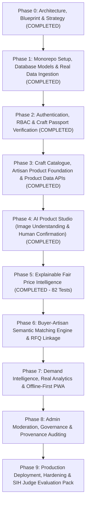

# SIH 26090: Phase-by-Phase Implementation Roadmap
## Engineering Milestones, Deliverables & Acceptance Criteria (Phase 0 to Phase 8)

---

## 1. Executive Implementation Overview

The SIH 26090 platform development is structured into 9 discrete, auditable engineering phases. Each phase builds upon the verified foundations of preceding phases, maintaining a clear separation between architecture, data ingestion, AI integration, user interfaces, and final demonstration polish.

---

## 2. Detailed Phase Specifications

### Phase 0: Engineering Blueprint, Architecture & Strategy (COMPLETED)
- **Objective**: Establish the complete architectural blueprint, relational entity specifications, AI module contracts, real-data sourcing framework, and deployment topology before executing any implementation code.
- **Key Deliverables**: `docs/project_blueprint.md`, `docs/architecture.md`, `docs/data_strategy.md`, `docs/ai_strategy.md`, `docs/security_strategy.md`, `docs/deployment_strategy.md`, `docs/phase_plan.md`, `PHASE_0_COMPLETION.md`.
- **Status**: Completed and approved.

---

### Phase 1: Monorepo Scaffolding, Database Models & Real Data Ingestion (COMPLETED)
- **Objective**: Scaffold the monorepo directory layout, configure Python/FastAPI and Next.js environments, deploy the 23 PostgreSQL database models with Alembic migrations, and ingest official Indian GI and ODOP public datasets.
- **Key Deliverables**: Monorepo layout, SQLAlchemy 2.0 ORM models, Alembic migrations, GI and ODOP real-data ingestion scripts (`scripts/ingestion/`).
- **Status**: Completed and verified (18/18 tests passing). `PHASE_1_COMPLETION.md`.

---

### Phase 2: Authentication, RBAC, Core Profile APIs & Craft Passport System (COMPLETED)
- **Objective**: Implement secure authentication (JWT with HttpOnly cookies, passwordless OTP flow), role-based access control, artisan and buyer profile management, and the digital Craft Passport engine.
- **Key Deliverables**: `backend/app/core/security.py`, `backend/app/api/v1/endpoints/auth.py`, `artisans.py`, `buyers.py`, `backend/app/services/passport_service.py`.
- **Status**: Completed and verified (35/35 tests passing). `PHASE_2_COMPLETION.md`.

---

### Phase 3: Craft Catalogue, Artisan Product Foundation & Product Data APIs (COMPLETED)
- **Objective**: Build the production-grade craft and product data foundation with hierarchical categories, artisan-craft skill associations, decoupled commercial parameters (stock, capacity, MOQ, lead time), media upload with SHA-256 integrity, and strict server-side ownership authorization.
- **Key Deliverables**: `craft_categories`, `artisan_crafts`, `products`, `product_media`, `product_attributes`, Alembic migration `20260326_0003_craft_catalogue_and_product_foundation.py`.
- **Status**: Completed and verified (50/50 tests passing). `PHASE_3_COMPLETION.md`.

---

### Phase 4: AI Product Studio — Image Understanding & Human Confirmation (COMPLETED)
- **Objective**: Build the AI Product Studio enabling artisans to submit product photos and generate structured attribute suggestions (title, materials, technique, story, dimensions, weight) with strict staging isolation, uncalibrated confidence scores, and mandatory human confirmation.
- **Key Deliverables**: `ai_product_analyses`, `ai_product_suggestions`, `ai/vision/client.py`, `ai/vision/prompts.py`, `backend/app/services/ai_studio_service.py`, `backend/app/api/v1/endpoints/ai_studio.py`, `frontend/src/app/artisan/products/[id]/studio/page.tsx`.
- **Status**: Completed and verified (68/68 tests passing). `PHASE_4_COMPLETION.md`.

---

### Phase 5: Explainable Fair Price Intelligence (COMPLETED)
- **Objective**: Build a transparent, deterministic, and evidence-backed Fair Price Intelligence module helping artisans understand production economics (materials, labor, overhead, packaging, freight), compare with genuine source-backed market observations, and obtain a defensible price range with a living-wage floor guarantee.
- **Key Deliverables**:
  - `ProductCostBreakdown` (`product_cost_breakdowns` table)
  - `MarketPriceObservation` (`market_price_observations` table)
  - `PriceAnalysis` (`price_analyses` table)
  - Alembic migration `20260326_0005_fair_price_intelligence.py`
  - Deterministic pricing engine `ai/pricing/engine.py` (`FAIR_PRICE_ENGINE_V1`) using Python `Decimal` (`ROUND_HALF_UP`)
  - Service layer `backend/app/services/pricing_service.py` with versioned snapshot persistence and audit logging
  - REST API endpoints `backend/app/api/v1/endpoints/pricing.py` (8 endpoints with strict RBAC & IDOR checks)
  - Artisan pricing UI `frontend/src/app/artisan/products/[id]/pricing/page.tsx`
  - Documentation: `docs/fair_price_engine.md`, `docs/pricing_model.md`, `docs/market_price_evidence.md`, `docs/price_calculation_methodology.md`, `docs/price_explainability.md`, `docs/pricing_security.md`
- **Status**: Completed and verified (82/82 tests passing). `PHASE_5_COMPLETION.md`.

---

### Phase 6: Buyer-Artisan Semantic Matching Engine & RFQ Linkage (PLANNING COMPLETE — PENDING EXECUTION)
- **Objective**: Implement multi-criteria hybrid semantic matching between buyer procurement requirements (RFQ) and artisan capacity/craft profiles using 768-dim vector embeddings, hard constraint filters, and explainable scoring decomposition, coupled with a full RFQ negotiation lifecycle.
- **Key Deliverables**:
  - `BuyerRequirement` schema extension & `RequirementUnderstanding` staging entity
  - Deterministic two-stage hybrid matching engine `ai/matching/engine.py` (`MATCHING_ENGINE_V1`)
  - Embedding provider abstraction (`BaseEmbeddingProvider`, `GeminiEmbeddingProvider`, `MockEmbeddingProvider`)
  - Alembic migration `20260326_0006_matching_and_rfq_linkage.py`
  - REST endpoints for requirements, staged understanding, matching runs, and RFQs (`/buyer-requirements`, `/matches`, `/rfqs`)
  - Next.js Buyer and Artisan RFQ portals
  - Comprehensive planning specification: `docs/phase_6_matching_plan.md`
- **Dependencies**: Phase 5 completion.
- **Status**: Completed and fully verified with 97/97 tests passing across Phases 1–6.

---

### Phase 7: Demand Intelligence, Real Analytics & Offline-First PWA (PLANNING COMPLETED — PENDING APPROVAL)
- **Objective**: Implement historical demand pattern aggregation, seasonal festival forecasting, sparse-data honesty protocols, and full PWA offline caching with IndexedDB and background sync.
- **Key Deliverables**:
  - **Workstream A (Demand Intelligence)**:
    - `DemandObservation` model extension & `DemandForecastRun` / `DemandForecastPoint` architecture
    - Deterministic demand aggregation service (by craft, category, state, monthly/quarterly/weekly periods)
    - Trend analysis engine (`INCREASING`, `DECREASING`, `STABLE`, `INSUFFICIENT_DATA`)
    - Classical forecasting service with strict $N \ge 12$ monthly eligibility threshold
    - Leakage-proof walk-forward temporal cross-validation
    - Demand REST APIs (`/api/v1/demand/...`)
    - Artisan demand snapshot UI & Admin multi-tier analytics dashboard
    - Comprehensive planning specification: `docs/phase_7_demand_intelligence_plan.md`
  - **Workstream B (Offline-First PWA)**:
    - Service Worker (`sw.js`) with CacheFirst app shell and StaleWhileRevalidate directory caching
    - Dexie IndexedDB read cache for authorized products, crafts, and RFQs
    - Offline Mutation Queue with client UUIDs and cryptographic idempotency keys
    - Automatic background sync engine with exponential backoff
    - Server-side idempotency tracking (`sync_operations` table) & `409 Conflict` detection
    - PWA web app manifest (`manifest.json`) and installability configuration
    - Comprehensive planning specification: `docs/phase_7_offline_pwa_plan.md`
- **Dependencies**: Phase 6 completion.
- **Status**: Architectural planning completed; pending user approval before implementation.

---

### Phase 8: Admin Governance Portal, Moderation Workflows & Provenance Auditing (UPCOMING)
- **Objective**: Implement administrative oversight, KYC and GI verification queues, content moderation, data source management, and immutable audit log exploration.
- **Key Deliverables**: Admin dashboard, verification review workflows, provenance audit log explorer.
- **Dependencies**: Phase 7 completion.

---

### Phase 9: Automated Testing Suite, Security Hardening & SIH Judge Evaluation Pack (UPCOMING)
- **Objective**: End-to-end integration tests, security vulnerability scans, production deployment, live demo scripts, and SIH judge evaluation materials.
- **Key Deliverables**:
  - Full automated regression test suite across backend and frontend.
  - Security hardening (OWASP Top 10, rate limiting, EXIF stripping).
  - Production deployment (Railway / Vercel containerization).
  - Step-by-step judge demonstration script covering all 12 core SIH requirements.
  - Seed demonstration data pack with authentic Indian handicrafts.
- **Dependencies**: Phase 8 completion.
- **Acceptance Criteria**: The platform can be demonstrated end-to-end to SIH judges in under 7 minutes, highlighting genuine real data, transparent AI explainability, fair pricing, and offline resilience.

---

## 3. Strict Phase Boundary Enforcement

> [!IMPORTANT]
> **Phase 0 is strictly limited to planning, architecture, and strategic specification.**
> No source code implementation, database migrations, model training, or data fabrication shall occur until Phase 0 is formally reviewed and approved by the engineering lead and stakeholders.
