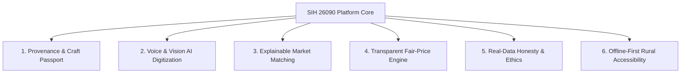
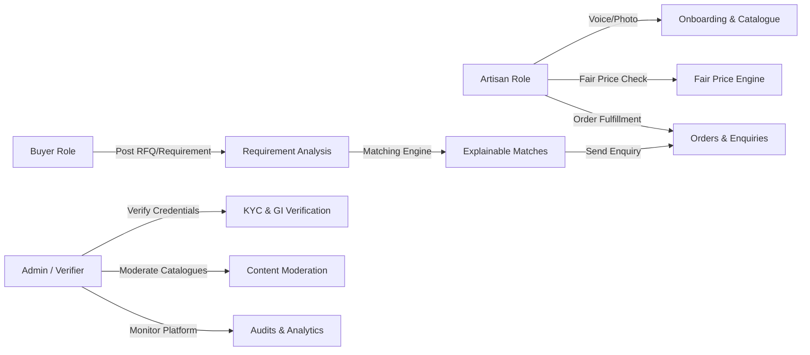

# SIH 26090: Artisan Market Linkage & Smart Seller Matching
## Complete Project Blueprint & Architectural Specification

---

## 1. Executive Summary & Vision

### 1.1 Problem Statement (SIH 26090)
India's artisanal and handicraft sector is the second-largest employment provider after agriculture, comprising over 7 million recognized artisans and more than 400 distinct craft clusters across 750+ districts. However, the ecosystem remains severely fragmented:
- **Middleman Exploitation**: Artisans typically realize only 15% to 30% of the final retail sale price, with predatory intermediaries capturing the bulk of margins.
- **Digital Divide & Literacy Barriers**: Rural artisans face substantial literacy and language barriers, preventing them from using complex e-commerce seller portals designed for corporate retailers.
- **Lack of Craft Provenance & Authenticity**: Commercial mass-produced imitations displace authentic handmade crafts, eroding customer trust and diminishing the economic value of Geographical Indication (GI) tags.
- **Unstructured Buyer Matching**: Institutional buyers, government procurement bodies (GeM), export aggregators, and bulk retail buyers struggle to find artisans capable of meeting specific material, capacity, delivery timeline, and ethical certification standards.
- **Opaque Pricing & Demand Asymmetry**: Artisans lack visibility into fair pricing structures, true raw material costs, and seasonal demand fluctuations, resulting in chronic underpricing or missed peak festive demand.

### 1.2 Project Vision
The **SIH 26090 Artisan Market Linkage Platform** is a production-grade, AI-powered system engineered specifically to link Indian artisans directly with enterprise, institutional, and retail buyers. 

**This is NOT a generic e-commerce portal.** The system focuses on **intelligent market linkage**, combining:
1. **AI Artisan Craft Passport**: Tamper-evident digital identity documenting craft lineage, master artisan certifications, GI cluster registration, and genuine capacity.
2. **Multilingual Voice-First Catalogue Creation**: Enabling a rural artisan speaking Hindi, Tamil, Telugu, Bengali, Marathi, or Gujarati to speak naturally about their craft and photograph their item, with AI handling transcription, technical attribute extraction, narrative storytelling, and catalogue generation.
3. **Transparent Fair-Price Intelligence**: Algorithmic cost-plus-margin engine that breaks down raw material costs, artisan labor hours, and statutory living wages, validating pricing against legitimate market indices.
4. **Explainable Buyer-Artisan Matching**: Multi-stage ranking engine that matches structured buyer requirements against verified artisan capabilities, delivering a fully transparent explanation matrix rather than arbitrary black-box percentages.
5. **Real-Data Demand Intelligence**: Regional and seasonal demand trend forecasting using actual historical transaction, enquiry, and cultural festival observations, with strict honesty safeguards that detect sparse data.
6. **Offline-First PWA Architecture**: Reliable operation in rural areas with intermittent 2G/3G connectivity through client-side IndexedDB caching, background synchronization, and media compression.

---

## 2. Core Pillars & Design Principles



### Pillar 1: Verified Craft Provenance
Every craft has an origin story, a cluster geography, and a material standard. The system provides a digital **Craft Passport** linked to official Geographical Indications (GI Registry of India), Ministry of Textiles Pehchan artisan cards, and cooperative cluster affiliations.

### Pillar 2: Low-Literacy, Voice-First Interaction
Artisans should not be required to type English product titles or navigate complex nested dropdown menus. The platform allows an artisan to upload a photo and record a 30-second voice note in their native tongue. AI processes the multimodal input into standardized catalogue specifications.

### Pillar 3: Explainable Linkage, Not Black-Box Recommendations
Enterprise buyers need justification for procurement decisions. The matching engine evaluates hard constraints (capacity, delivery date, materials) and soft criteria (craft heritage, past reliability, geographic proximity), outputting a transparent scorecard that explains exactly why an artisan was matched.

### Pillar 4: Fair-Price Transparency
Instead of competitive bidding that drives artisans into poverty wages, the Fair-Price Engine calculates recommended price floors based on actual raw material costs, standard labor hours, master craftsman skill tiers, and fair living wage standards.

### Pillar 5: Real Data & AI Honesty Charter
- **Zero Fabrication**: No synthetic reviews, artificial demand spikes, or fabricated government records.
- **Explicit Confidence Grading**: Every AI output is tagged with confidence levels and source provenance.
- **Sparse Data Integrity**: When historical data is insufficient for forecasting, the system explicitly reports "Insufficient historical observations" rather than inventing a misleading prediction.

---

## 3. User Roles & Scenario Workflows



### 3.1 Role 1: Artisan
Artisans represent individual craftspeople, self-help groups (SHGs), weaver cooperatives, and tribal artisan clusters.
- **Registration & Profile**: Mobile phone OTP authentication, voice-guided language selection, basic profile setup (name, cooperative name, location, craft specialization).
- **Craft Passport Setup**: Upload of Pehchan ID (Ministry of Textiles), State Handicraft Board certificates, or GI affiliation documents; display of verified verification status badges.
- **Voice-Assisted Listing**: Upload 1–5 photographs of a product, record a voice description in any supported Indic language (Hindi, Marathi, Tamil, Telugu, Bengali, Gujarati, Kannada, Odia, English).
- **AI Catalogue Review**: Review generated title, attributes, dimensions, materials, care instructions, and cultural storytelling narrative; confirm or adjust AI suggestions.
- **Fair-Price Calculator**: Input raw material expenditure and hours spent; receive recommended wholesale floor price, direct-to-consumer fair price, and institutional price.
- **Buyer Enquiries & Matches**: Receive notification of buyer requirements matching craft skills and capacity; accept or counter enquiries.
- **Offline Mode**: Draft new listings, record voice notes, and review existing inventory while completely offline.

### 3.2 Role 2: Buyer
Buyers include boutique retail curators, institutional corporate gifting teams, government procurement agencies (GeM / PSUs), interior designers, and global export aggregators.
- **Profile & Intent Profiling**: Registration with business type (B2B Bulk, Institutional Gifting, Retail Curator, Export).
- **Requirement Creation (RFQ)**:
  - Form-based input: Craft category, required quantity, deadline, target price range, custom specifications.
  - AI-assisted RFQ: Upload a reference mood board/image or unstructured text document; AI extracts structured parameters (craft type, material, estimated unit requirement).
- **Intelligent Matching**: Real-time evaluation of artisan candidates across capacity, lead time, price alignment, and craft authenticity.
- **Explainable Match Results**: Interactive match breakdown showing why each artisan was recommended (e.g., "94% Match: 100% material match (Mulberry Silk), verified GI Tag (Chanderi), production capacity 50 units/month meets your 40-unit order, price within ±5% of your target").
- **Direct Linkage & Enquiries**: Send structured enquiries, request physical material swatches, negotiate delivery schedules, and initiate digital orders.

### 3.3 Role 3: Platform Admin & Regional Verifier
Platform administrators and field verifiers ensure trust, compliance, and platform integrity.
- **Artisan Verification**: Review artisan verification documents (Pehchan ID, Aadhaar, cooperative registration, GI certificates) against official registries.
- **Catalogue Moderation**: Review flagged products, AI extraction errors, and provenance claims.
- **Data Source & Ingestion Management**: Manage real-data feeds (ODOP district lists, GI Registry updates, wholesale raw material price benchmarks, wholesale market indices).
- **Audit Logs & Governance**: Immutable audit trail of verification decisions, role assignments, price overrides, and data imports.
- **Platform Analytics**: Geographic distribution of active craft clusters, fulfillment rates, enquiry-to-order conversions, and fair price realization ratios.

---

## 4. Repository Monorepo Structure

To ensure clean separation of concerns, scalability, and independent deployment cycles, the project is structured as a professional monorepo:

```
sih-26090-artisan-market-linkage/
├── .github/
│   └── workflows/
│       ├── frontend-ci.yml           # Lint, typecheck, and build Next.js frontend
│       ├── backend-ci.yml            # Lint (ruff), typecheck (mypy), and pytest backend
│       └── ai-pipeline-ci.yml        # Test AI extraction and matching regression suite
├── frontend/                         # Next.js 14+ App Router, React 19, TypeScript
│   ├── public/
│   │   ├── icons/                    # PWA icons & craft badges
│   │   ├── locales/                  # Static i18n translation strings
│   │   └── sw.js                     # Workbox Service Worker for offline PWA
│   ├── src/
│   │   ├── app/                      # Next.js App Router (artisan, buyer, admin routes)
│   │   ├── components/
│   │   │   ├── ui/                   # Core design system primitives (TailwindCSS)
│   │   │   ├── artisan/              # Voice recorder, camera upload, passport card
│   │   │   ├── buyer/                # Match breakdown scorecard, RFQ builder
│   │   │   ├── shared/               # Navigation, language switcher, honesty badges
│   │   │   └── admin/                # Verification queue, audit viewer, analytics charts
│   │   ├── lib/
│   │   │   ├── api.ts                # Typed Axios / Fetch client with auth interceptors
│   │   │   ├── offline-db.ts         # Dexie.js (IndexedDB) for offline queue & cache
│   │   │   └── pwa-register.ts       # Service worker lifecycle manager
│   │   ├── hooks/                    # Custom React hooks (useVoiceRecorder, useOfflineSync)
│   │   ├── store/                    # Zustand state stores (auth, listingDraft, offlineQueue)
│   │   └── types/                    # Shared TypeScript interfaces
│   ├── next.config.ts
│   ├── tailwind.config.ts
│   └── package.json
├── backend/                          # Python 3.11+ FastAPI Async REST API
│   ├── app/
│   │   ├── api/
│   │   │   └── v1/
│   │   │       ├── endpoints/        # auth, artisans, buyers, products, matches, pricing, demand, admin
│   │   │       └── router.py         # Top-level API router
│   │   ├── core/
│   │   │   ├── config.py             # Pydantic v2 BaseSettings loading .env
│   │   │   ├── database.py           # Async SQLAlchemy engine & session factory
│   │   │   ├── security.py           # JWT generation, password hashing, RBAC guards
│   │   │   ├── telemetry.py          # Structured logging & OpenTelemetry tracing
│   │   │   └── exceptions.py         # Custom application exception handlers
│   │   ├── models/                   # SQLAlchemy 2.0 ORM models with pgvector embeddings
│   │   ├── schemas/                  # Pydantic v2 DTOs (Request & Response schemas)
│   │   ├── services/                 # Domain logic services (Matching, Pricing, Passport, etc.)
│   │   ├── repositories/             # Database access layer with async query abstractions
│   │   └── integrations/             # External adapters (S3/R2 storage, SMS/WhatsApp gateway)
│   ├── alembic/                      # Database migrations
│   │   ├── versions/
│   │   └── env.py
│   ├── requirements.txt
│   ├── pyproject.toml
│   └── Dockerfile
├── ai/                               # Decoupled AI Inference & Pipeline Service
│   ├── pipelines/
│   │   ├── vision_pipeline.py        # Image understanding & attribute detection
│   │   ├── voice_pipeline.py         # Whisper / IndicASR transcription & language detection
│   │   ├── catalogue_pipeline.py     # Cultural storytelling & metadata synthesis
│   │   ├── matching_pipeline.py      # Multi-stage explainable matching pipeline
│   │   ├── pricing_pipeline.py       # Cost breakdown & fair price intelligence
│   │   └── demand_pipeline.py        # Trend analysis with sparse data detection
│   ├── prompts/                      # Standardized, version-controlled prompt templates
│   ├── clients/                      # LLM & Vision client adapters (Gemini, Open-Source, etc.)
│   └── evaluators/                   # Golden benchmark test datasets for extraction accuracy
├── data/                             # Data Assets & Ingestion Pipelines
│   ├── raw/                          # Raw public data files (ODOP, GI Registry, Census)
│   ├── processed/                    # Sanitized, deduplicated JSON/Parquet seeds
│   ├── provenance_manifest.json      # Provenance registry of all external data sources
│   └── schemas/                      # Data validation schemas
├── scripts/                          # Engineering & Maintenance Utilities
│   ├── ingest_gi_registry.py         # Parser for official Indian GI handicraft registry
│   ├── ingest_odop_data.py           # Parser for One District One Product district mapping
│   ├── ingest_material_indices.py    # Ingestion of wholesale raw material price benchmarks
│   ├── seed_database.py              # Idempotent DB seeder with sample/real flags
│   └── benchmark_matching.py         # Performance and latency benchmark for matching engine
├── tests/                            # Comprehensive Automated Test Suite
│   ├── unit/                         # Unit tests for matching math, pricing math, DTOs
│   ├── integration/                  # FastAPI TestClient endpoint integration tests
│   ├── ai/                           # AI response schema validation and hallucination checks
│   └── e2e/                          # End-to-end user journey tests (Playwright)
├── docs/                             # Engineering Architecture & Specifications
│   ├── project_blueprint.md          # Master architecture and specifications (this file)
│   ├── architecture.md               # Technical architecture and component interactions
│   ├── data_strategy.md              # Real-data sources, provenance, and database schema
│   ├── ai_strategy.md                # 12 AI modules, explainability, and prompt governance
│   ├── security_strategy.md          # Authentication, RBAC, media safety, and audit logs
│   ├── deployment_strategy.md        # Vercel, Railway, PostgreSQL, and storage deployment
│   └── phase_plan.md                 # Multi-phase roadmap and milestones
├── infrastructure/                   # Cloud & Container Configuration
│   ├── docker-compose.yml            # Local dev stack (Postgres + pgvector, MinIO, Backend)
│   ├── docker-compose.prod.yml       # Production container orchestration
│   └── nginx/                        # Reverse proxy & SSL termination configuration
├── .env.example                      # Complete template of all required environment variables
├── README.md                         # Project overview, setup guide, and SIH demonstration flow
└── PHASE_0_COMPLETION.md             # Formal Phase 0 sign-off and Phase 1 roadmap
```

---

## 5. Traceability Matrix: SIH Requirements to Engineering Components

| SIH Requirement | Subsystem / Module | Key Technical Implementation | Deliverable Artifact |
|---|---|---|---|
| **A. Craft Passport / Profile** | `backend/services/passport_service.py` | GI Registry link, Pehchan verification, digital QR craft passport | `docs/data_strategy.md`, `docs/architecture.md` |
| **B. AI Catalogue Generation** | `ai/pipelines/catalogue_pipeline.py` | Cultural narrative generation, SEO metadata, technical attributes | `docs/ai_strategy.md` |
| **C. Photo-based Understanding** | `ai/pipelines/vision_pipeline.py` | Computer vision classification of weave, craft technique, color palette | `docs/ai_strategy.md` |
| **D. Voice-First Catalogue** | `ai/pipelines/voice_pipeline.py` | Web Audio capture, Whisper/IndicASR regional transcription | `docs/ai_strategy.md` |
| **E. Multilingual Interaction** | `frontend/src/locales/` + AI Translation | 8 Indic languages + English, automated transliteration and localization | `docs/ai_strategy.md`, `docs/architecture.md` |
| **F. Fair-Price Intelligence** | `backend/services/pricing_service.py` | Direct cost breakdown + skill-weighted living wage + market baseline | `docs/ai_strategy.md`, `docs/data_strategy.md` |
| **G. Buyer-Artisan Matching** | `backend/services/matching_service.py` | Multi-stage pipeline: Hard filter -> Vector recall -> Constraint scoring | `docs/ai_strategy.md`, `docs/architecture.md` |
| **H. Explainable Matching** | `backend/services/matching_service.py` | Decomposed factor scorecard (Material, Capacity, GI, Price, Timeline) | `docs/ai_strategy.md` |
| **I. Demand Intelligence** | `backend/services/demand_service.py` | Seasonal festival calendar + historical enquiry aggregations + sparse detector | `docs/ai_strategy.md`, `docs/data_strategy.md` |
| **J. Offline / Low-Bandwidth** | `frontend/src/lib/offline-db.ts` | PWA Service Worker + Dexie IndexedDB + Background Sync API | `docs/architecture.md`, `docs/deployment_strategy.md` |
| **K. Marketplace / Orders** | `backend/api/v1/endpoints/orders.py` | Enquiry state machine, swatch requests, escrow milestones, audit logs | `docs/data_strategy.md`, `docs/security_strategy.md` |
| **L. Analytics & Monitoring** | `backend/api/v1/endpoints/admin.py` | OpenTelemetry instrumentation, cluster heatmaps, fair wage indices | `docs/deployment_strategy.md` |

---

## 6. Information Integrity & AI Honesty Charter

To ensure absolute credibility during the Smart India Hackathon evaluation and real-world deployment, the platform implements a 6-tier classification for all data presented across the UI and APIs:

```
[Tier 1: VERIFIED FACT]
Data confirmed by official government registries (GI Registry of India, Pehchan ID, GeM) or verified documents.
Displayed with Green "Verified Fact" badge.

[Tier 2: USER-PROVIDED INFORMATION]
Data entered directly by the artisan or buyer (e.g., claimed production capacity, self-reported years of experience).
Displayed with Neutral "User Declared" badge.

[Tier 3: AI-GENERATED SUGGESTION]
Attributes extracted or suggested by AI (e.g., image-detected weave pattern, auto-generated product description).
Displayed with Amber "AI Suggestion" badge. Must be confirmed by the artisan before becoming persistent catalogue data.

[Tier 4: PREDICTION / ESTIMATE]
Statistical or heuristic projections (e.g., regional festival demand estimates, delivery transit times).
Displayed with Purple "Projection" badge with explicit confidence intervals.

[Tier 5: RECOMMENDATION]
Algorithmic matching outputs (e.g., matched artisan scorecards).
Accompanied by an explainable factor scorecard showing individual weight contributions.

[Tier 6: DEMO / SAMPLE DATA]
Records generated for testing or demonstration purposes.
Permanently flagged with an unmistakable Red/Orange badge: [DEMO / SAMPLE DATA].
```

**Honest Error States**:
When underlying data is missing or statistical confidence is low, the platform **refuses to hallucinate**. 
For example:
- *Demand Forecasting with zero transaction history*: Returns `"Status: Insufficient historical observations for reliable trend analysis. Reverting to national craft cluster baseline."`
- *Image AI with ambiguous weave pattern*: Returns `"Confidence: 42% (Low). Please select craft technique manually from the verified list."`

---

## 7. Next Phase Readiness & Summary

Phase 0 establishes the complete blueprint, architectural foundation, data contracts, and implementation strategy. No code is implemented in Phase 0. 

Following user review and formal Phase 0 approval, Phase 1 will initiate the repository scaffolding, database schema deployment via Alembic migrations, and ingestion of legitimate public Indian craft datasets.
