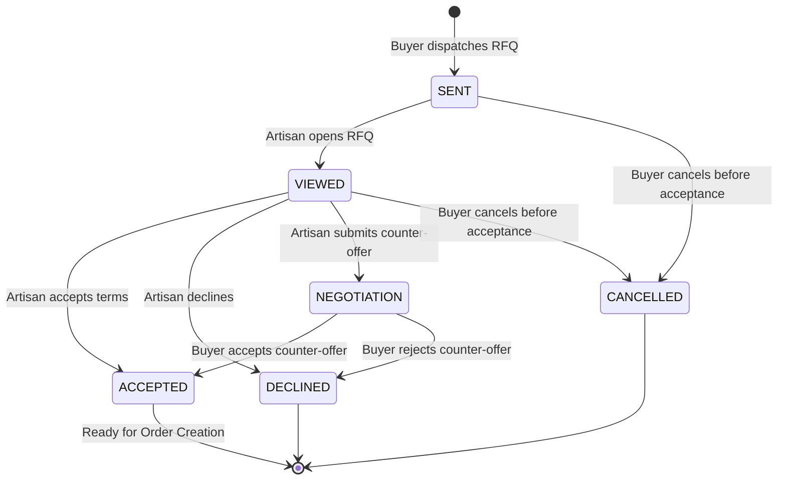

# SIH 26090: RFQ Commercial Linkage & Negotiation Lifecycle

---

## 1. Executive Summary

Once a buyer reviews ranked match candidates and chooses to engage an artisan, the platform transitions from discovery to formal procurement via the **Request for Quotation (RFQ) Linkage Engine**.

The RFQ engine preserves institutional accountability through:
1. Unique verifiable RFQ reference numbers (`RFQ-YYYYMMDD-XXXX`).
2. Two-way transparent negotiation state machine with counter-offer support.
3. Strict party-to-transaction IDOR verification.
4. Complete audit trail of message exchanges, price negotiations, and status transitions.

---

## 2. RFQ State Machine



### State Definitions

- `SENT`: The RFQ has been created and dispatched to the artisan. The artisan has not yet opened it.
- `VIEWED`: The artisan has opened the RFQ detail view. Automatic timestamp recorded (`viewed_at`).
- `NEGOTIATION`: The artisan cannot meet the exact proposed terms (price or timeline) and has submitted a formal counter-offer (`counter_unit_price_inr`, `counter_lead_time_days`, `counter_notes`).
- `ACCEPTED`: Either party accepted the current terms (artisan accepted initial terms, or buyer accepted counter-offer terms). Ready for commercial ordering in Phase 7.
- `DECLINED`: The RFQ was explicitly rejected by either party with structured reason notes.
- `CANCELLED`: The buyer withdrew the RFQ before formal commitment.

---

## 3. IDOR Protection & Authorization Matrix

Commercial procurement data is strictly private. Every RFQ endpoint enforces server-side identity checks:

| Action | Allowed Roles | Authorization Verification Rule |
|---|---|---|
| `POST /api/v1/rfqs` | `buyer` | User must own active `BuyerProfile`. Product and artisan must exist. |
| `GET /api/v1/rfqs/sent` | `buyer` | Returns only RFQs where `enquiry.buyer_id == current_user.buyer_profile.id`. |
| `GET /api/v1/rfqs/received` | `artisan` | Returns only RFQs where `enquiry.artisan_id == current_user.artisan_profile.id`. |
| `GET /api/v1/rfqs/{id}` | `buyer`, `artisan`, `admin` | User must be either the issuing buyer or receiving artisan (or platform admin). |
| `POST /api/v1/rfqs/{id}/view` | `artisan` | `enquiry.artisan_id == current_user.artisan_profile.id`. |
| `POST /api/v1/rfqs/{id}/respond` | `artisan` | `enquiry.artisan_id == current_user.artisan_profile.id`. Only allowed in non-terminal states. |
| `POST /api/v1/rfqs/{id}/buyer-decision` | `buyer` | `enquiry.buyer_id == current_user.buyer_profile.id`. Only allowed when status is `NEGOTIATION`. |

---

## 4. Counter-Offer Data Contract

When an artisan proposes alternative terms:
```json
{
  "action": "COUNTER_OFFER",
  "counter_unit_price_inr": 1950.00,
  "counter_lead_time_days": 28,
  "notes": "Due to authentic natural vegetable dye curing, lead time is 28 days. Offering ₹1,950 for batch of 100."
}
```

The system:
1. Records `counter_unit_price_inr`, `counter_lead_time_days`, and appends notes to negotiation thread.
2. Updates `status` to `NEGOTIATION`.
3. Records `responded_at` timestamp.
4. Dispatches buyer notification for review and final decision.
