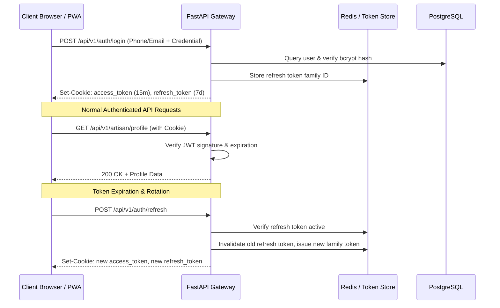

# SIH 26090: Security, Identity & Governance Strategy
## Enterprise-Grade Threat Modeling, RBAC Matrix & Defensive Engineering

---

## 1. Authentication & Identity Management

### 1.1 Multi-Mode Authentication Strategy
To accommodate both rural artisans with low digital literacy and institutional buyers requiring corporate governance:
1. **Artisan Mobile OTP Flow**: Passwordless authentication via SMS/WhatsApp one-time passcode (OTP). Cryptographically generated 6-digit numeric tokens with a 5-minute TTL, rate-limited to 3 attempts per phone number per hour.
2. **Buyer & Admin Credential Flow**: Standard email/phone + password authentication. Passwords hashed using `bcrypt` (work factor 12) with salt generation.
3. **Session Architecture**:
   - **Access Token**: Short-lived JSON Web Token (JWT, RS256 or HS256, 15-minute expiration) containing user UUID, role, and permission scopes.
   - **Refresh Token**: Long-lived opaque token (7-day expiration) stored in PostgreSQL with token family rotation and revocation tracking.
   - **Cookie Security**: Tokens delivered via `HttpOnly`, `Secure`, `SameSite=Lax` cookies to prevent client-side XSS extraction.



---

## 2. Role-Based Access Control (RBAC) Matrix

The system implements granular authorization boundaries across four core roles:

| API Domain / Resource | Artisan Role | Buyer Role | Admin / Verifier Role | Anonymous Public |
|---|---|---|---|---|
| **Public Craft & Catalogue Search** | Read | Read | Read | Read |
| **Craft Passport Verification View** | Read Own | Read All Public | Read All | Read All Public |
| **Artisan KYC Document Upload** | Create / Update Own | Denied | Read All / Verify | Denied |
| **Product Catalogue Creation** | Create / Edit Own | Denied | Review / Moderate | Denied |
| **Fair-Price Calculator Execution** | Execute Own | Denied | View Aggregates | Denied |
| **Buyer RFQ Posting** | Denied | Create / Edit Own | Moderate / Audit | Denied |
| **Smart Match Scorecard View** | View Own Matches | View Own Matches | View All Matches | Denied |
| **Enquiry & Negotiation Chat** | Participate Own | Participate Own | Audit Access | Denied |
| **Data Source Ingestion Execution** | Denied | Denied | Execute / Manage | Denied |
| **Audit Logs Inspection** | Denied | Denied | Read Full Audit Trail | Denied |

### Enforcement Pattern
Enforced using FastAPI Dependency Injection guards:
```python
# Declarative RBAC enforcement decorator
@router.post("/verifications/{artisan_id}/approve")
async def approve_artisan_verification(
    artisan_id: UUID,
    current_user: User = Depends(require_role(["admin", "verifier"])),
    db: AsyncSession = Depends(get_async_db)
):
    ...
```

---

## 3. Media Upload Hardening & Privacy Protection

Artisans upload photographs of products and images of government credentials (Pehchan cards, Aadhaar, cooperative certificates). This creates vectors for malware upload, EXIF data leaks, and storage exhaustion.

### 3.1 Upload Security Controls
1. **Magic Bytes Validation**: File types are verified by inspecting the binary header (magic numbers) via `python-magic`, preventing disguised `.exe` or `.sh` files from masquerading as `.jpg` or `.png`.
2. **File Size Hard Limits**:
   - Product Photographs: Maximum 10MB per image.
   - Voice Audio Notes: Maximum 25MB (Opus / WebM format only).
   - KYC Verification Documents: Maximum 5MB (PDF, JPEG, PNG only).
3. **EXIF Metadata Stripping**: Automated stripping of all EXIF metadata from uploaded photographs prior to storage. This prevents leaking the exact GPS coordinates of rural artisans' residences and home workshops.
4. **Pre-Signed Upload Strategy**: Direct upload from browser to S3/R2 storage with a 15-minute pre-signed PUT token and content-type locking, bypassing the application server memory.
5. **Randomized Object Storage Paths**: Files stored under non-enumerable UUID paths:
   `s3://artisan-media-public/products/{product_uuid}/{media_uuid}.webp`

---

## 4. API Hardening & Vulnerability Mitigation

| Threat Vector (OWASP Top 10) | Defensive Architecture Implemented |
|---|---|
| **SQL Injection (SQLi)** | 100% parameterized queries via SQLAlchemy 2.0 ORM; raw string SQL concatenation is strictly banned in CI lint rules. |
| **Cross-Site Scripting (XSS)** | React/Next.js default context-aware HTML escaping; rich storytelling text sanitized via `DOMPurify` before rendering. |
| **Cross-Site Request Forgery (CSRF)** | `SameSite=Lax` cookies for browser sessions; custom header verification (`X-Requested-With` or `X-CSRF-Token`) for state-modifying requests. |
| **Broken Object-Level Auth (BOLA/IDOR)** | Every data mutation verifies that the authenticated `current_user.id` owns the target entity before executing updates. |
| **API Rate Limiting & DoS** | Leaky-bucket rate limiting via Redis: 60 requests/minute for standard APIs, 5 requests/minute for AI inference endpoints, 3 attempts/hour for OTP login. |
| **Server-Side Request Forgery (SSRF)** | External URL fetching (e.g., verifying government data sources) restricted to an explicit domain whitelist (`ipindia.gov.in`, `data.gov.in`). |
| **Secret Exfiltration** | Strict zero-secrets-in-git policy; automated pre-commit scanning with `trufflehog` and GitHub Secret Scanning. |

---

## 5. Immutable Audit Logging Specification

All security-sensitive operations generate an unalterable log record in the `audit_logs` table:

```json
{
  "audit_event": {
    "event_id": "9b1deb4d-3b7d-4bad-9bdd-2b0d7b3dcb6d",
    "timestamp": "2026-03-26T14:45:10.250Z",
    "actor": {
      "user_id": "c4a7f052-1205-4f36-a19c-85f096236b32",
      "role": "verifier",
      "ip_address": "49.36.128.45",
      "user_agent": "Mozilla/5.0 (Windows NT 10.0; Win64; x64)"
    },
    "action": "VERIFICATION_STATUS_UPDATE",
    "target_entity": {
      "type": "ArtisanProfile",
      "id": "e816a759-b14e-4f11-85f1-3d9692482e98"
    },
    "diff": {
      "before": {"verification_status": "PENDING"},
      "after": {"verification_status": "GOVERNMENT_VERIFIED_GI", "verified_gi_tag": "GI-104"}
    }
  }
}
```

Audit records are append-only. No `UPDATE` or `DELETE` permissions are granted on the `audit_logs` table to any application role.
