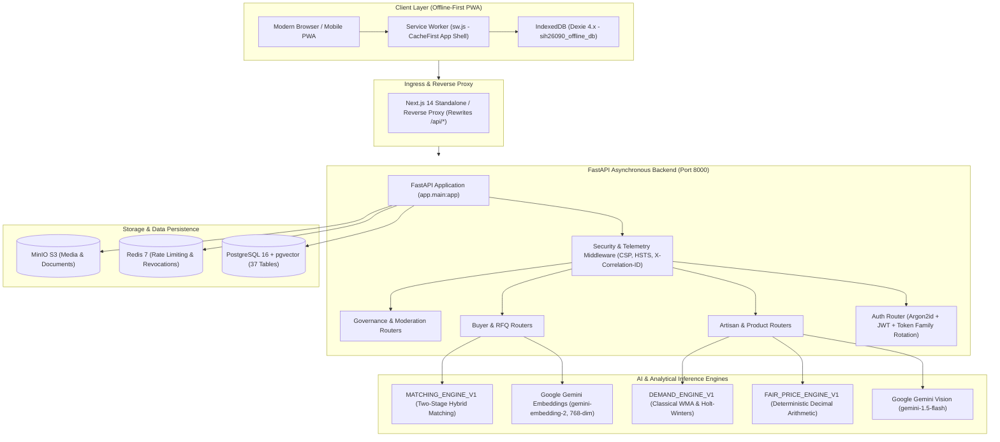

# SIH 26090: TECHNICAL ARCHITECTURE SPECIFICATION
## Comprehensive End-to-End System Blueprint

**Project**: SIH 26090 – Artisan Market Linkage & Smart Seller Matching  
**Phase**: Phase 9 — Production Deployment & Judge Pack  

---

## 1. System Topology & Architecture Diagram

---

## 2. Layer-by-Layer Architectural Details

### 2.1 Client Layer (Next.js 14 PWA)
- **Framework**: Next.js 14.2 App Router, React 18, TypeScript, TailwindCSS.
- **Service Worker (`sw.js`)**: Implements `CacheFirst` for static assets (`/_next/static/*`), `StaleWhileRevalidate` for craft taxonomies, and `NetworkOnly` with IndexedDB fallback for transactional endpoints (`/api/v1/products`, `/api/v1/rfqs`).
- **IndexedDB (`Dexie 4.x`)**: Stores local draft products, craft master references, and an append-only mutation queue.
- **Security & Privacy**: Zero sensitive KYC credentials or identity documents stored in browser storage. Instant local storage wipe on logout.

### 2.2 Backend Application Layer (FastAPI 0.100+)
- **Architecture**: Async REST API built with Python 3.11+, SQLAlchemy 2.0 async engine, and Pydantic v2 schemas.
- **Workers**: Uvicorn worker model behind multi-stage Docker container.
- **Security Middleware**:
  - `X-Correlation-ID`: Generated or propagated across all requests and responses.
  - `15MB Request Limit`: Rejects oversized payload denial-of-service attempts with HTTP 413.
  - `Security Headers`: `X-Content-Type-Options: nosniff`, `X-Frame-Options: DENY`, `X-XSS-Protection: 1; mode=block`, and production `Strict-Transport-Security`.
  - `Global Error Masking`: Production unhandled exception handler masks internal stack traces, returning safe generic error responses with correlation IDs.

### 2.3 Relational Database Layer (PostgreSQL 16 + pgvector)
- **Schema**: 37 declarative models covering authentication, profiles, crafts, products, media, AI studio, pricing runs, market observations, buyer requirements, matches, RFQs, demand observations, forecasts, sync operations, governance flags, moderation decisions, and provenance events.
- **Vector Search**: `pgvector` indexing 768-dimensional normalized dense vectors with cosine distance (`<=>`).
- **Migrations**: Alembic linear sequence (8 revisions from `20260326_0001` to `20260327_0008` head).

### 2.4 AI Inference & Analytical Engines
- **Vision Understanding**: `GeminiVisionProvider` connecting to Google Gemini REST API. Suggestions staged in `ai_studio_runs`.
- **Semantic Embeddings**: `GeminiEmbeddingProvider` connecting to `gemini-embedding-2` with `output_dimensionality=768`.
- **Hybrid Matching**: `MATCHING_ENGINE_V1` combining deterministic hard constraint elimination and 7-component multi-criteria scoring.
- **Fair Price Intelligence**: `FAIR_PRICE_ENGINE_V1` with pure Python Decimal arithmetic, living wage floor guarantee, and $N \ge 3$ evidence threshold.
- **Demand Intelligence**: `DEMAND_ENGINE_V1` with multi-gate eligibility ($N \ge 12$), missing data checks ($<20\%$), and chronological walk-forward cross-validation.

### 2.5 Cryptographic Provenance Chain
- **Hash Chaining**:
  $$\text{event\_hash} = \text{SHA-256}\left(\text{canonical\_json}(\text{payload}) \parallel \text{prev\_event\_hash}\right)$$
- **Canonical Serialization**: Stable key ordering (`sort_keys=True`), compact separators (`(',', ':')`), UTC ISO-8601 timestamps.
- **Tamper Detection**: On-demand integrity verification detects byte-level tampering and sequence breaks.
