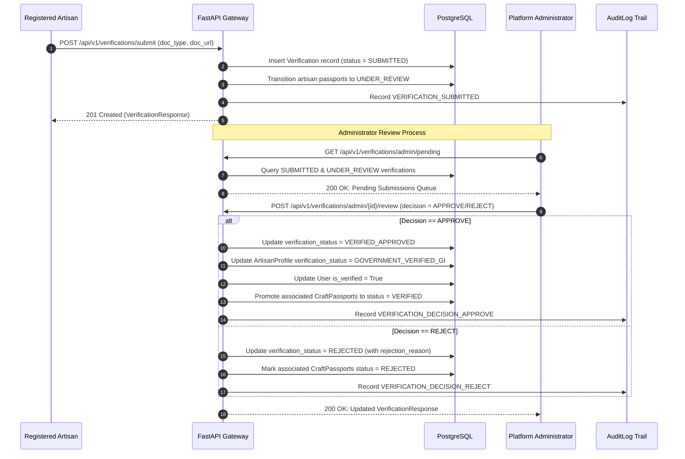

# SIH 26090: Verification Review Workflow
## KYC Document Submission, Administrative Review, State Transitions & Immutable Audit Logging

---

## 1. Overview

Authenticity in **SIH 26090** is anchored in verifiable credentials. The platform enables artisans to submit official documentation (such as Ministry of Textiles Pehchan cards or Geographical Indications Authorized User certificates) and provides administrators with an audited review workflow to inspect, approve, reject, or request corrections.

---

## 2. Document Taxonomy

Supported verification document types:
- `GI_AUTHORIZED_USER_CERT`: Official certificate issued by the Controller General of Patents, Designs and Trade Marks (CGPDTM) granting authorized user status under the GI of Goods Act, 1999.
- `PEHCHAN_CARD`: Government-issued identity card for handloom and handicraft artisans by the Development Commissioner (Handicrafts/Handlooms).
- `COOPERATIVE_MEMBERSHIP`: Certified membership certificate from a registered primary weaver or artisan cooperative society.
- `STATE_CRAFT_AWARD`: Official state or national merit certificate validating master artisan status.

---

## 3. End-to-End Review Sequence



---

## 4. API Endpoints

### 4.1 Artisan Document Submission
- **Endpoint**: `POST /api/v1/verifications/submit`
- **Role Required**: `artisan`
- **Request Body**:
  ```json
  {
    "document_type": "GI_AUTHORIZED_USER_CERT",
    "document_url": "https://storage.artisanlinkage.in/docs/cert_123.pdf"
  }
  ```
- **Side Effect**: Automatically promotes all `DRAFT` and `SUBMITTED` passports belonging to the artisan to `UNDER_REVIEW`.

### 4.2 Artisan Submission History
- **Endpoint**: `GET /api/v1/verifications/my`
- **Role Required**: `artisan`
- **Response**: List of past and current verification attempts with admin notes and decision dates.

### 4.3 Administrator Pending Queue
- **Endpoint**: `GET /api/v1/verifications/admin/pending`
- **Role Required**: `admin`
- **Response**: FIFO queue of unreviewed submissions filtered by status `SUBMITTED` and `UNDER_REVIEW`.

### 4.4 Administrator Review Action
- **Endpoint**: `POST /api/v1/verifications/admin/{verification_id}/review`
- **Role Required**: `admin`
- **Request Body**:
  ```json
  {
    "decision": "APPROVE",
    "rejection_reason": null,
    "admin_notes": "Verified against official CGPDTM GI registry records for Chanderi cluster."
  }
  ```
- **Side Effects**:
  - `APPROVE`: Updates artisan profile to `GOVERNMENT_VERIFIED_GI`, sets `User.is_verified = True`, and promotes associated passports to `VERIFIED`.
  - `REJECT`: Sets verification status to `REJECTED`, marks passports `REJECTED`, and stores actionable feedback in `rejection_reason`.

---

## 5. Immutable Audit Logging

Every verification transition generates an immutable record in `audit_logs` capturing:
- `action`: `VERIFICATION_SUBMITTED`, `VERIFICATION_DECISION_APPROVE`, `VERIFICATION_DECISION_REJECT`.
- `actor_user_id`: UUID of the artisan or administrator taking action.
- `entity_type`: `Verification`.
- `ip_address`: Client remote IP.
- `payload_after`: Decision and administrative notes.
